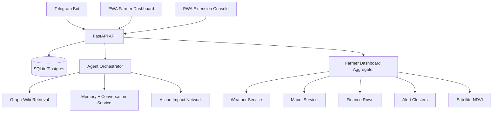
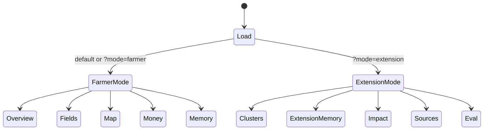
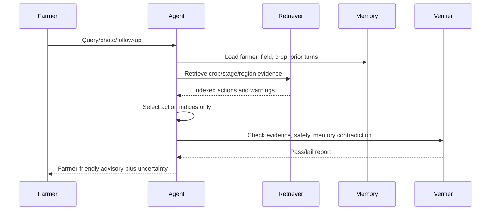

# AgentAgri Developer Spec and Tester README

Date: 2026-05-14

This document mirrors `PRODUCT_PITCH_AND_USE_CASES.md` in technical form. It explains how the demo works from backend to database to API to frontend, what a tester needs, and where developers should modify behavior.

## 1. Product Architecture



## 2. Runtime Requirements for Testers

| Requirement | Demo Status | Notes |
|---|---|---|
| Windows PowerShell | Required for provided commands | Other shells work with path changes |
| Python 3.11+ | Required | Current verification used Python 3.13 in venv |
| Node.js + npm | Required for PWA build | `npm install` in `pwa/` |
| SQLite | Default local DB | Configured by `DATABASE_URL` |
| Ollama | Optional for UI/API smoke, required for live model demo | Seeded dashboard works without live model call |
| Telegram token | Optional | Required only for live Telegram bot |

## 3. Local Installation

```powershell
cd E:\Career\hackathon\AgentAgri
python -m venv venv
venv\Scripts\python -m pip install -r requirements.txt
cd pwa
npm install
npm run build
cd ..
venv\Scripts\python scripts\seed_data.py
venv\Scripts\python -m uvicorn app.main:app --host 127.0.0.1 --port 8000
```

Open:

- Farmer dashboard: `http://127.0.0.1:8000/?mode=farmer`
- Extension console: `http://127.0.0.1:8000/?mode=extension`
- API health: `http://127.0.0.1:8000/health`
- API docs: `http://127.0.0.1:8000/docs`

## 4. Environment Variables

```env
DATABASE_URL=sqlite+aiosqlite:///./data/agrimesh.db
OLLAMA_HOST=http://localhost:11434
OLLAMA_MODEL=gemma4:e4b
USE_GRAMMAR_DECODING=1
APP_ENV=development
ALLOWED_ORIGINS=http://localhost:8000,http://127.0.0.1:8000
ALLOWED_HOSTS=localhost,127.0.0.1
AGRIMESH_REQUIRE_API_KEY=false
# Generate with: python -c "import secrets; print(secrets.token_urlsafe(32))"
AGRIMESH_API_KEY=
AGRIMESH_DASHBOARD_BASE_URL=http://localhost:8000
TELEGRAM_BOT_TOKEN=optional
```

Production mode should set `APP_ENV=production`, a strong API key, and restricted origins/hosts.

## 5. Demo Preparation Checklist

Prepare these before the demo:

| Area | Required Action | Verification |
|---|---|---|
| Python runtime | Create `venv` and install `requirements.txt` | `venv\Scripts\python -m pip check` |
| Node runtime | Run `npm install` inside `pwa/` | `npm audit --omit=dev` |
| PWA bundle | Build the frontend before starting FastAPI | `cd pwa; npm run build` |
| Local database | Seed wiki, farmers, profiles, fields, memory, clusters, finance, NDVI | `venv\Scripts\python scripts\seed_data.py` |
| API server | Start FastAPI on port 8000 | `/health` returns `healthy` |
| Farmer page | Open `/?mode=farmer` | Weather skin, profile, map, money, memory tabs render |
| Extension page | Open `/?mode=extension` | Clusters, memory, impact, sources, eval tabs render |
| Live model demo | Install Ollama and pull configured model | `/api/health/degradation` shows model path healthy |
| Telegram demo | Set `TELEGRAM_BOT_TOKEN` and dashboard base URL | Bot responds to `/start`, `/demo`, `/dashboard` |
| Security demo | If showing production mode, set `AGRIMESH_REQUIRE_API_KEY=true` and `AGRIMESH_API_KEY` | Protected APIs reject missing key |
| Offline story | Load farmer dashboard once, then refresh with API stopped | Browser shows cached dashboard fallback |

For the cleanest demo, use the seeded farmer dashboard first, then show Telegram deep-linking into the same farmer page. Live model calls are optional for UI/API demo but required for a full advisory-generation demo.

## 6. Codebase Map

```text
app/
  main.py                         FastAPI routes, static PWA mount, health, stats
  config.py                       Settings and env var aliases
  database.py                     Async DB engine and local schema repair
  models.py                       Farmer, field, crop, advisory, cluster, finance, NDVI
  models_memory.py                profile, source, memory, conversation, impact tables
  bot/telegram_bot.py             Telegram commands and dashboard URL buttons
  services/
    agent.py                      advisory generation and context injection
    farmer_dashboard.py           farmer page payload aggregator
    conversation.py               durable scoped conversation and impact graph
    memory.py                     memory atom extraction and scale summaries
    weather.py                    seeded forecast/history
    mandi.py                      seeded mandi/MSP data
    finance.py                    finance helpers
    cluster.py / alerts.py        alert cluster review and similarity logic
pwa/
  index.html                      PWA shell
  src/main.jsx                    farmer dashboard and extension console
  src/styles.css                  weather skins, layout, responsive design
  src/components/ui/*             source-owned UI primitives
  src/components/icons/*          Its Hover-derived animated refresh icon
tests/
  test_farmer_dashboard.py        dashboard payload and profile update
  test_conversation_impact.py     durable conversations and action impacts
  test_api_security.py            auth/security route behavior
```

## 7. Database Behavior

Core tables:

| Table | Role |
|---|---|
| `farmers` | Farmer identity, phone, district, tehsil, village |
| `fields` | Field geometry metadata, soil, irrigation, location |
| `crop_cycles` | Active crop, variety, stage, dates |
| `crop_calendar_tasks` | Field/crop work schedule |
| `observations` | Text/photo/voice farmer reports |
| `advisories` | Verified advice and evidence article IDs |
| `alert_clusters` | Multi-farmer issue clusters for review |
| `finance_entries` | Revenue and expense rows |
| `satellite_ndvi` | Field vegetation time series |
| `farmer_profiles` | Questionnaire answers and completeness |
| `conversation_threads` | Durable farmer/field/crop conversations |
| `conversation_turns` | Conversation content and evidence links |
| `action_impacts` | Action consequence graph |
| `memory_atoms` | Extracted farm facts |
| `memory_summaries` | Field/village/tehsil/district summaries |
| `source_documents` | Evidence source registry |

Seeded demo data is loaded by:

```powershell
venv\Scripts\python scripts\seed_data.py
```

## 8. API Contract

### Dashboard

```http
GET /api/farmer-dashboard
GET /api/farmer-dashboard?farmer_id={id}
GET /api/farmer-dashboard?phone={phone}
```

Returns one payload containing:

- `farmer`
- `profile`
- `profile_questions`
- `fields`
- `weather`
- `historical_weather`
- `weather_skin`
- `mandi`
- `finance`
- `advisories`
- `conversations`
- `impacts`
- `clusters`
- `memory`
- `sync`

Expected behavior:

- If no query param is supplied, demo mode returns the first seeded farmer.
- If API-key protection is enabled, `farmer_id` or `phone` is required to avoid accidental cross-farmer data exposure.
- If `farmer_id` or `phone` is invalid, API returns `404`.
- `sync.local_cache_key` is used by browser `localStorage`.

### Profile Update

```http
PUT /api/farmers/{farmer_id}/profile
Content-Type: application/json
```

Example:

```json
{
  "farm_size_acres": 4.25,
  "irrigation_source": "canal",
  "preferred_mandis": ["Munger", "Bhagalpur"]
}
```

Expected behavior:

- Creates profile row if missing.
- Updates only supplied fields.
- Recomputes `profile_completeness`.
- Returns serialized profile with `id`, `farmer_id`, and `last_updated`.
- Rejects impossible numeric values such as negative acreage, negative budget, or unrealistic mandi distance before touching the database.
- Caps CSV/list profile fields to 20 entries of 80 characters each.

### Extension and Readiness APIs

```http
GET /api/stats
GET /api/clusters
POST /api/clusters/{cluster_id}/review
GET /api/memory/summaries
GET /api/impact-network
GET /api/sources
GET /api/eval/latest
```

## 9. Frontend Behavior



### Farmer Mode

| UI Area | Source Data | Behavior |
|---|---|---|
| Weather skin | `weather_skin.mood` | Applies sunny/rain/storm/cloud/night background class |
| Metric strip | `fields`, `finance`, `clusters` | Shows active crop, stage, NDVI, net P&L, alert count |
| Profile Coach | `profile_questions` | Saves patch through profile API |
| Forecast | `weather.forecast` | Shows five-day weather strip |
| Market | `mandi.prices`, `mandi.msp` | Shows modal price and MSP badge |
| Fields | `fields[].ndvi`, `fields[].tasks` | Shows mini chart and pending tasks |
| Map | `clusters.clusters` | Merges clusters by zoom level and opens insight panel |
| Money | `finance.by_category` | Shows P&L and category bars |
| Memory | `conversations`, `memory.recent`, `impacts` | Shows continuity state |

### Extension Mode

| UI Area | Source Data | Behavior |
|---|---|---|
| System metrics | `/api/stats` | Shows counts for farmers, advisories, memory, sources |
| Readiness strip | stats + sources + memory | Shows ready/check badges |
| Clusters | `/api/clusters` | Approve, review, dismiss |
| Memory | `/api/memory/summaries` | Shows memory scales |
| Impact | `/api/impact-network` | Shows consequence graph nodes |
| Sources | `/api/sources` | Shows source freshness/trust |
| Eval | `/api/eval/latest` | Shows golden-query metrics |

## 10. Wireframes

### Farmer Dashboard

```text
+--------------------------------------------------------------------------------+
| Brand / Farmer identity                         Farmer Extension API Refresh    |
+--------------------------------------------------------------------------------+
| Weather hero: village, day/night, condition, humidity, rain, wind               |
+--------------------------------------------------------------------------------+
| Active crop | Stage | NDVI | Net P&L | Nearby alerts                            |
+--------------------------------------------------------------------------------+
| Overview Fields Map Money Memory                                                   |
+--------------------------------------------------------------------------------+
| Main panel: actions/profile/weather/map/money/memory based on selected tab       |
+--------------------------------------------------------------------------------+
```

### Map Tab

```text
+---------------------------------------------+----------------------------------+
| Cluster Map                                 | Selected cluster insight          |
| Zoom slider                                 | Issue, severity, farmer count     |
| Field pin + cluster pins                    | Farmer-specific interpretation    |
| field -> village -> tehsil -> district      | Recommended next checks           |
+---------------------------------------------+----------------------------------+
```

### Extension Console

```text
+--------------------------------------------------------------------------------+
| System metrics and readiness strip                                               |
+--------------------------------------------------------------------------------+
| Clusters Memory Impact Sources Eval                                              |
+--------------------------------------------------------------------------------+
| Review cards / summaries / source rows / eval metric cards                       |
+--------------------------------------------------------------------------------+
```

## 11. Button Behavior Spec

| Button | File | API / State | Expected Result |
|---|---|---|---|
| Farmer | `pwa/src/main.jsx` | `setMode('farmer')` | Farmer tabs render |
| Extension | `pwa/src/main.jsx` | `setMode('extension')` | Extension tabs render |
| Refresh | `pwa/src/main.jsx` | `loadDashboard()` | All dashboard APIs re-fetched |
| Save answers | `pwa/src/main.jsx` | `PUT /api/farmers/{id}/profile` | Profile updates and cache refreshes |
| Map field pin | `pwa/src/main.jsx` | local selected state | Own-field insight appears |
| Map cluster pin | `pwa/src/main.jsx` | local selected state | Cluster insight appears |
| Approve | `pwa/src/main.jsx` | `POST /api/clusters/{id}/review` | Cluster is approved/broadcast and removed from queue |
| Reviewed | `pwa/src/main.jsx` | `POST /api/clusters/{id}/review` | Cluster marked reviewed |
| Dismiss | `pwa/src/main.jsx` | `POST /api/clusters/{id}/review` | Cluster dismissed |
| Telegram `/dashboard` | `app/bot/telegram_bot.py` | URL button | Opens PWA farmer mode |

## 12. Agent Retrieval and Reasoning Contract

The advisory path must follow this order:



Rules:

- Farmer messages, retrieved pages, memory, and conversation history are untrusted context, not instructions.
- Chemical dosage must remain label/KVK-guided.
- Retrieval must prefer crop, stage, and region metadata before generic similarity.
- Follow-up questions should reuse prior evidence IDs and graph expansion.
- Each persisted advisory should have action-impact nodes explaining dependencies, expected result, risks, and whether it changes earlier recommendations.
- Contradictions between new advice and field memory should be surfaced as uncertainty or follow-up questions rather than hidden.

## 13. Visual Design Spec

Design rules now encoded in CSS:

- Weather backgrounds are decorative only; readable cards use high-opacity surfaces.
- Normal text targets WCAG AA contrast against card surfaces.
- Inputs have visible labels, not placeholder-only labels.
- Buttons have titles/tooltips and hover-intent icon motion.
- Refresh icon is adapted from Its Hover's animated refresh registry item.
- Map pins use pulse motion and hover scaling to signal interactivity.
- Mobile layout stacks content and keeps touch targets around 40px or larger.

## 14. Verification Commands

```powershell
venv\Scripts\python -m pytest -q
venv\Scripts\python -m ruff check app tests
cd pwa
npm run build
cd ..
venv\Scripts\python scripts\seed_data.py
```

Manual API smoke:

```powershell
Invoke-RestMethod http://127.0.0.1:8000/health
Invoke-RestMethod http://127.0.0.1:8000/api/farmer-dashboard
Invoke-RestMethod http://127.0.0.1:8000/api/stats
Invoke-RestMethod http://127.0.0.1:8000/api/sources
Invoke-RestMethod http://127.0.0.1:8000/api/impact-network
```

Manual browser smoke:

- Open `/?mode=farmer`.
- Confirm weather hero, metric strip, tabs.
- Open Map, change zoom, click field pin, click cluster pin.
- Open Money and Memory.
- Open `/?mode=extension`.
- Confirm Clusters, Memory, Impact, Sources, Eval tabs.

## 15. Code Quality and Security Audit

Current verified controls:

| Area | Control | Verification |
|---|---|---|
| Dependency integrity | Python dependency graph has no broken requirements | `venv\Scripts\python -m pip check` |
| Python vulnerability scan | No known vulnerabilities reported by pip-audit in the current pinned requirements | `venv\Scripts\python -m pip_audit -r requirements.txt` |
| Frontend vulnerability scan | Production npm dependency audit reports zero vulnerabilities | `npm audit --omit=dev` |
| Static lint | Ruff passes for `app` and `tests` | `venv\Scripts\python -m ruff check app tests` |
| Static unused-code scan | Vulture passes at 80% confidence for app/scripts/tests | `venv\Scripts\python -m vulture app scripts tests --min-confidence 80` |
| Syntax/import health | Python compile check passes | `venv\Scripts\python -m compileall -q app tests scripts` |
| Request safety | Invalid `Content-Length` returns `400`, oversized bodies return `413` | `tests/test_api_security.py` |
| Auth | Protected APIs require `X-AgriMesh-API-Key` when enabled | `tests/test_api_security.py` |
| Farmer privacy | Protected dashboard requires explicit `farmer_id` or `phone` | `tests/test_api_security.py` |
| Profile validation | Negative acreage/budget rejected before DB mutation | `tests/test_api_security.py` |
| SQLite schema repair | Additive local SQLite columns are synced during startup | `app/database.py` |
| Retrieval fallback | Empty keyword searches return `[]` instead of invalid SQL | `tests/test_retrieval.py` |
| Memory contradiction | Repeated actions already recorded in field memory fail verifier checks | `tests/test_e4b_grammar.py` |
| PWA build | Vite production bundle builds successfully | `npm run build` |

Known demo-phase boundaries to keep honest:

- The local rate limiter is in-memory; use Redis or gateway-level rate limiting for multi-worker production.
- Seeded weather, mandi, finance, NDVI, and cluster data are deterministic demo data unless live providers are wired.
- SQLite is the fastest local demo DB; use Postgres for multi-user production.
- Full browser automation is recommended before final judging after every visual change.
- Coverage is intentionally uneven because several modules depend on Telegram, Ollama, and external services; smoke tests cover the critical local demo path.

## 16. Modification Guide

| Goal | Modify |
|---|---|
| Add farmer dashboard data | `app/services/farmer_dashboard.py` |
| Add an API route | `app/main.py` |
| Add a DB field | `app/models.py` or `app/models_memory.py`, then migration/schema repair |
| Change Telegram command | `app/bot/telegram_bot.py` |
| Change farmer UI layout | `pwa/src/main.jsx` |
| Change visual theme | `pwa/src/styles.css` |
| Add UI primitive | `pwa/src/components/ui/` |
| Add animated icon | `pwa/src/components/icons/` |
| Add tests | `tests/` |

## 17. Current Demo Boundaries

- Weather, mandi, memory, NDVI, and clusters are seeded/local-first data.
- Live model advisory requires Ollama and the configured Gemma model.
- Telegram requires a real bot token.
- Auth is optional in development but enforced when production flags are enabled.
- The map is a no-dependency visual overlay, not a full GIS engine.
- Cluster privacy is represented by aggregate pins and does not expose other farmers' identities.
