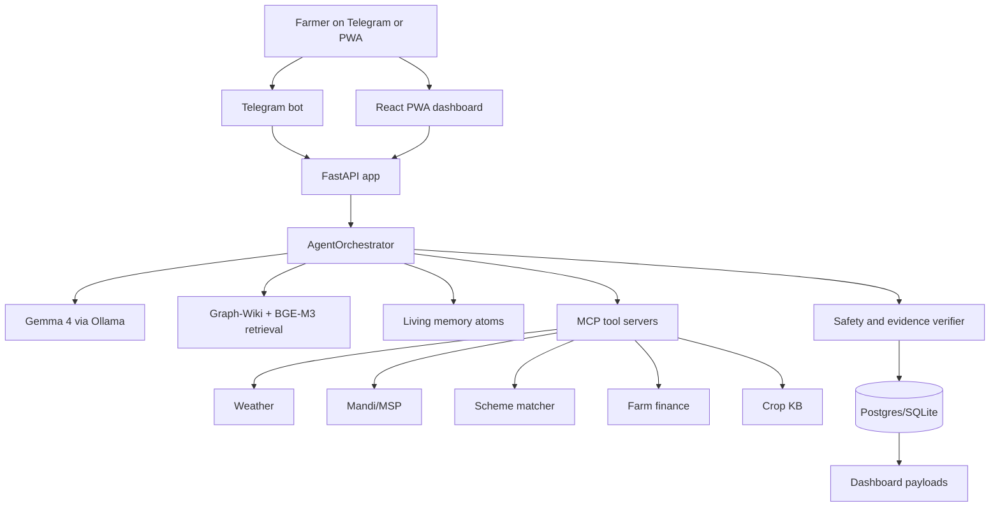
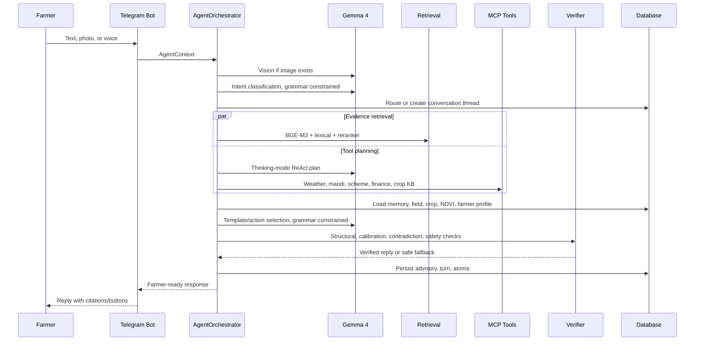
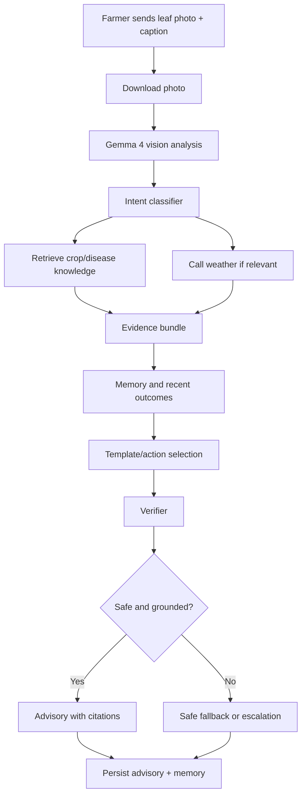
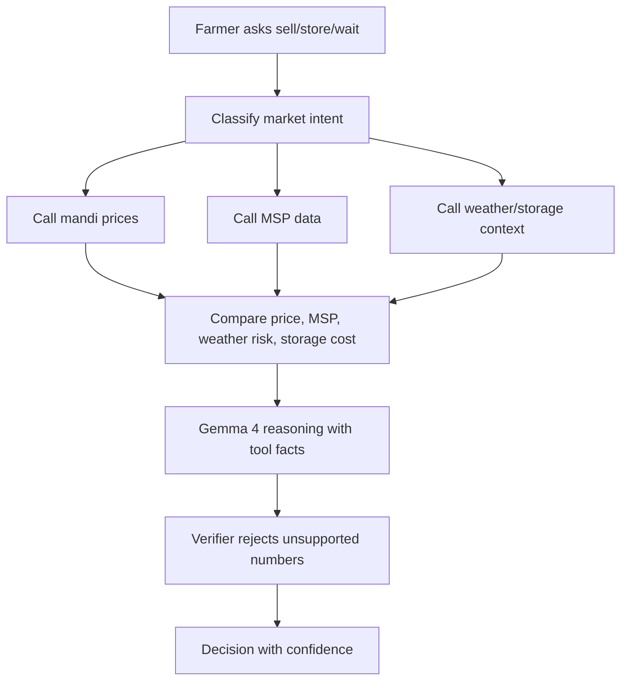
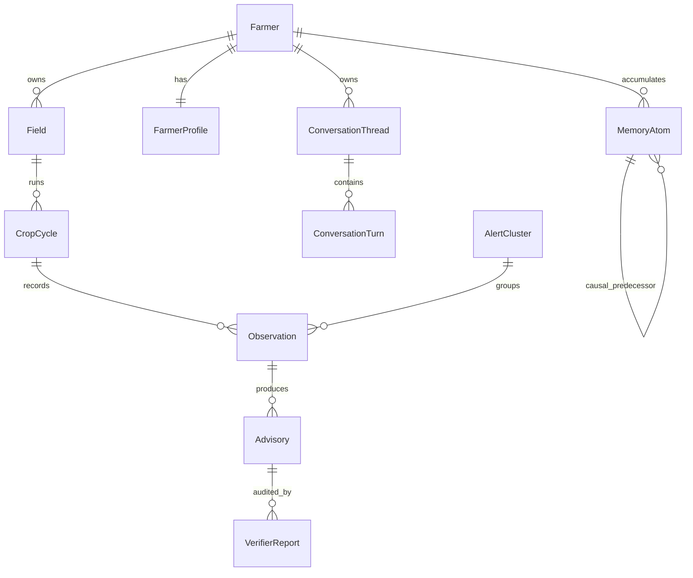
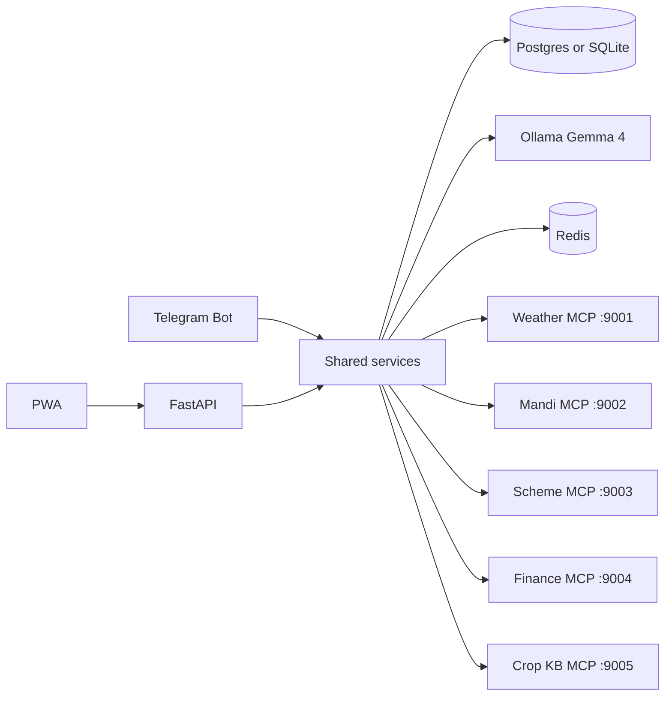
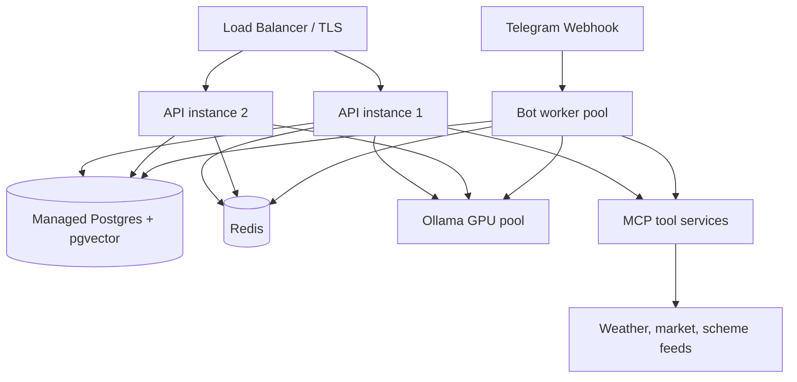

# AgriMesh

AI agricultural intelligence agent for smallholder farmers, built around Gemma 4, FastAPI, Telegram, a React PWA, MCP-style tools, living memory, Graph-Wiki retrieval, and evidence-checked advisories.

This is the single project document. All other project documentation has been consolidated here.

## Table Of Contents

1. [What AgriMesh Solves](#what-agrimesh-solves)
2. [Evidence And Public Value](#evidence-and-public-value)
3. [Product Vision](#product-vision)
4. [System Overview](#system-overview)
5. [How Gemma 4 Is Used](#how-gemma-4-is-used)
6. [Feature Inventory And Logic](#feature-inventory-and-logic)
7. [Farmer Workflows](#farmer-workflows)
8. [Architecture](#architecture)
9. [Engineering Details](#engineering-details)
10. [Every Button And Command](#every-button-and-command)
11. [API Reference](#api-reference)
12. [Reproduce Locally](#reproduce-locally)
13. [Production Deployment At Scale](#production-deployment-at-scale)
14. [Security, Privacy, And Responsible AI](#security-privacy-and-responsible-ai)
15. [Evaluation And Testing](#evaluation-and-testing)
16. [Troubleshooting](#troubleshooting)
17. [Sources](#sources)

## What AgriMesh Solves

AgriMesh turns a basic farmer chat into an evidence-grounded agricultural advisor. A farmer can send text, voice, or a crop photo through Telegram; the backend classifies the intent, analyzes the image if present, retrieves local agronomy knowledge, calls live tools for weather, mandi, schemes, and finance, checks the answer for safety, then replies in the farmer's language with citations and a memory trail.

The product is optimized for smallholder agriculture where advice must be timely, local, explainable, and cheap enough to run at scale. It targets three recurring problems:

| Problem | AgriMesh Response |
|---|---|
| Crop disease and pest decisions arrive late or without confidence. | Photo + text advisory, Graph-Wiki retrieval, official IPM manuals, confidence labels, verifier, follow-up memory. |
| Farmers lack market and scheme context at the moment of decision. | Mandi/MSP tools, scheme matching, finance ledger, sell/store reasoning, dashboard history. |
| One farmer's observation rarely helps nearby farmers before the issue spreads. | Privacy-gated memory atoms, k-anonymous cross-farmer learning, outbreak alerts across village, pincode, tehsil, and district. |

The system is not meant to replace certified agronomists, KVK officers, or pesticide labels. It is a first-line decision support layer that escalates uncertain and safety-critical cases.

## Evidence And Public Value

The need is real and measurable.

| Evidence | Why It Matters For This Agent |
|---|---|
| FAO reports that small family farmers produce around one-third of the world's food, while farms under one hectare are about 70% of all farms and operate only about 7% of agricultural land. | Small farms carry food-system importance despite limited land and capital, so low-cost advisory can have outsized value. |
| FAO/IPPC reports that plant pests can destroy up to 40% of global crop production annually and cause large trade and economic losses. | Early pest and disease detection is a high-leverage use case, especially when paired with local outbreak signals. |
| India's Agriculture Census 2015-16 reports that small and marginal holdings form about 86% of operational holdings. | The core Indian user is land-constrained; advice must improve risk, timing, input efficiency, and market access without assuming high capital. |
| Research on digital agricultural advice notes that many farmers have weak access to science-based extension, with farmer-to-extension-worker ratios often above 1000:1 in many LMIC contexts. | AI advisory can scale routine triage and reserve scarce human extension capacity for hard or high-risk cases. |
| WRI summarizes evidence that digital climate-informed advisory services can improve productivity and resilience, with reported high returns where services are localized and acted upon. | AgriMesh combines weather, crop stage, memory, and local market context instead of giving generic advice. |

Public-good effects are expected at three levels:

| Level | Impact |
|---|---|
| Primary | Better disease triage, safer pesticide behavior, improved market decisions, clearer scheme eligibility, and field-specific memory. |
| Secondary | Lower avoidable crop loss, reduced unnecessary chemical use, improved household income predictability, and more confidence when negotiating with buyers or officers. |
| Tertiary | Community outbreak intelligence, aggregated climate-risk signals, anonymized research data, and better allocation of extension-worker attention. |

Risk controls are equally important. Bad agricultural advice can waste money, damage soil and water, harm applicators, or spread false confidence. AgriMesh therefore uses retrieval, official manuals, grammar-constrained model output, a verifier, confidence language, and escalation rules.

## Product Vision

AgriMesh's north star is: one agent, one accessible chat surface, every common farmer question handled with memory and evidence.

The farmer should not need to know whether their question is about pathology, weather, finance, government schemes, or market timing. They should be able to say:

```text
धान के पत्ते पर भूरे धब्बे हैं, क्या करूं?
```

and receive:

- a likely risk hypothesis;
- immediate non-harmful actions;
- a reason grounded in evidence;
- a warning when chemical or severe disease escalation is unsafe;
- a memory-aware follow-up path;
- a dashboard trail for later review.

The long-term vision is a local-first agricultural operating layer that works across crops, languages, and countries by swapping the knowledge pack and tool servers while keeping the same Gemma 4 orchestration, memory, verifier, and dashboard.

## System Overview



Runtime processes:

| Process | File | Role |
|---|---|---|
| FastAPI app | `app/main.py` | Serves REST API, PWA, health checks, model metadata, dashboard data, cluster review, eval outputs. |
| Telegram bot | `app/bot/telegram_bot.py` | Main farmer interface: commands, onboarding, text/photo/voice handlers, buttons, signed dashboard link. |
| Agent orchestrator | `app/services/agent.py` | 9-step advisory pipeline. |
| Ollama client | `app/utils/ollama_client.py` | Gemma 4 calls, grammar-constrained schemas, fallback model, capability logging. |
| MCP servers | `app/mcp_servers/*.py` | Weather, mandi, scheme, finance, crop knowledge tools. |
| PWA | `pwa/src/main.jsx` | Dashboard, market, weather, Gemma capability proof, history, settings. |

## How Gemma 4 Is Used

AgriMesh is designed to extract maximum utility from Gemma 4 without letting the model become an unchecked free-text authority.

| Gemma 4 Capability | Implementation | Farmer Value |
|---|---|---|
| Thinking mode | `OllamaClient.chat(..., thinking=True)` prepends the native thinking token for ReAct planning. | More deliberate tool choice for complex questions such as sell/store, outbreak context, or scheme eligibility. |
| Function calling | `plan_tools()` emits schema-bound tool calls; `AgentOrchestrator._execute_tool()` dispatches to MCP servers. | Weather, mandi, MSP, finance, and scheme facts come from tools instead of hallucinated numbers. |
| Multimodal vision | `analyze_crop_photo()` sends crop images to Gemma 4 and logs `multimodal` capability events. | Farmers can show a diseased leaf instead of describing lesions precisely in text. |
| Grammar-constrained decoding | JSON schemas in `app/schemas/` are passed through Ollama's `format` field for intent, tool plans, safety checks, templates, and cluster summaries. | The model returns constrained labels, indices, and structured fields, reducing parsing failures and unsupported claims. |
| Multilingual output binding | `_language_directive()` binds replies to English or a selected Indic language plus English block where appropriate. | Farmers can use Hindi, English, or supported Indic-language preferences while operators still get English traceability. |
| Local inference | Ollama hosts `gemma4:e4b` primary and `gemma4:e2b` fallback. | No per-query cloud API fee by default and better data sovereignty. |

Capability proof is exposed live:

- `GET /api/v1/capabilities`
- PWA route `/gemma4`
- Telegram advisory footer when enabled
- in-process ring buffer in `app/services/capability_log.py`

### Gemma 4 Advisory Pipeline



## Feature Inventory And Logic

| Feature | Logic | Main Files |
|---|---|---|
| Text advisory | Free text goes to intent classification, retrieval, tool planning, memory, template selection, verifier, persistence. | `app/bot/telegram_bot.py`, `app/services/agent.py` |
| Photo diagnosis | Bot downloads the largest Telegram photo, passes path to Gemma 4 vision, then uses the vision hypothesis as advisory context. | `handle_photo`, `OllamaClient.analyze_crop_photo` |
| Voice loop | OGG/audio is saved; Sarvam STT/TTS can transcribe, translate, synthesize, and degrade to text fallback. | `app/services/voice.py`, `handle_voice` |
| Farmer registration | Multi-step state machine captures name, phone, district, pincode, tehsil, village, field, soil, crop, sowing date, crop stage. | `telegram_bot.py` registration handlers |
| Field and crop cycles | Farmers can create/switch fields and crop cycles. Crop stage can be inferred from LLM intent and written back. | `models.py`, `telegram_bot.py`, `agent.py` |
| Graph-Wiki RAG | Dense retrieval, lexical boost, cross-encoder rerank, top evidence articles, previous-advisory bias for follow-ups. | `app/services/retrieval.py` |
| Living memory | Memory atoms have temporal decay, causal predecessors, outcome boosts, privacy scopes, and redaction support. | `app/services/memory.py`, `models_memory.py` |
| Cross-farmer learning | Similar-farm context is returned only after k-anonymity is satisfied. | `retrieve_similar_farm_context` |
| Outbreak warning | Negative outcomes or pest/disease reports cascade from village to pincode to tehsil to district; threshold is 10% with a 2-reporter floor. | `app/services/outbreak.py` |
| Market intelligence | Mandi prices, MSP context, sell/store logic, and market history are available to agent and dashboard. | `app/services/mandi.py`, `market_intel.py`, `mcp_servers/mandi_server.py` |
| Finance | Expenses and sales roll into active-cycle P&L. | `finance.py`, Telegram `/expense`, `/sale`, `/finance` |
| Scheme matching | Farmer profile and crop/location data are matched against seed scheme data. | `scheme.py`, `mcp_servers/scheme_server.py` |
| Verifier | Checks structural index validity, memory contradiction, evidence calibration, and pesticide safety. | `app/services/verifier.py` |
| Degradation | If model/tools fail, the app can fall back to cached data, deterministic templates, or safe fallback text. | `app/services/degradation.py`, `ollama_client.py` |
| Dashboard | Reads the same DB as the bot and shows farm, risks, evidence, tools, history, memory, model capability proof. | `pwa/src/main.jsx`, `farmer_dashboard.py` |

## Farmer Workflows

### Registration

```mermaid
flowchart TD
    A[/start] --> B[Pick language]
    B --> C[/register]
    C --> D[Name]
    D --> E[Phone]
    E --> F[District]
    F --> G[Pincode]
    G --> H[Tehsil]
    H --> I[Village]
    I --> J[Field name and area]
    J --> K[Soil type button]
    K --> L[Crop name]
    L --> M[Sowing date]
    M --> N[Stage button]
    N --> O[Farmer can ask questions]
```

### Disease Or Pest Question



### Market Decision



### Outbreak Alert

```mermaid
flowchart TD
    A[/outcome worsened or no_change] --> B[Extract crop and threat]
    B --> C[Check recent reports in village]
    C --> D{Threshold crossed?}
    D -- No --> E[Try pincode]
    E --> F{Threshold crossed?}
    F -- No --> G[Try tehsil]
    G --> H{Threshold crossed?}
    H -- No --> I[Try district]
    I --> J{Threshold crossed?}
    D -- Yes --> K[Create AlertCluster]
    F -- Yes --> K
    H -- Yes --> K
    J -- Yes --> K
    K --> L[Notify relevant farmers]
    K --> M[Write public outbreak memory atom]
    J -- No --> N[No alert]
```

## Architecture

### Repository Map

```text
AgentAgri/
  app/
    main.py                  FastAPI app, middleware, API routes, PWA serving
    config.py                Environment settings and production validation
    database.py              Async SQLAlchemy engine/session
    models.py                Core farmer, field, crop, observation, advisory models
    models_memory.py         Memory atoms, conversation threads, turns
    api/v1/auth.py           Demo dashboard sessions
    bot/telegram_bot.py      Telegram command, callback, media handlers
    mcp_servers/             Weather, mandi, scheme, finance, crop KB servers
    schemas/                 JSON schemas for constrained model output
    services/                Agent, memory, retrieval, evidence, dashboard, market, finance, alerts
    utils/                   Ollama client, safety, security, time
  alembic/                   Database migrations
  data/seed/                 Seed prices, schemes, weather, memory, KB sections
  data/reference/            Runtime knowledge assets and official manuals
  evals/                     Golden datasets and scorecard outputs
  pwa/                       React/Vite dashboard
  scripts/                   Seed, smoke, readiness, scoring utilities
  tests/                     Pytest suite
  wiki/articles/             Graph-Wiki article seed corpus
```

### Data Model



### Process Topology



## Engineering Details

### AgentOrchestrator

`app/services/agent.py` owns the high-level decision loop:

1. hydrate farmer, field, location, and land context;
2. run Gemma 4 vision for images;
3. load conversation context;
4. classify intent with grammar-constrained JSON;
5. route the conversation thread;
6. fire speculative retrieval;
7. plan and execute tools with thinking mode;
8. load memory, profile, and NDVI context;
9. select actions/templates with structured output;
10. verify;
11. format citations and confidence;
12. persist advisory, verifier report, memory atoms, and conversation turn.

### Retrieval

The retrieval stack is deliberately hybrid:

| Layer | Purpose |
|---|---|
| BGE-M3 dense retrieval | Finds semantically related crop/pest/scheme content. |
| Lexical boost | Favors explicit crop, title, and topic-tag matches. |
| BGE reranker | Promotes the best final evidence cards. |
| Previous article bias | Helps follow-up questions stay anchored to the last advisory. |
| Universal KB | Adds common issue memory and official reference manuals. |

### Verifier

The verifier is the guardrail between model output and farmer action:

| Check | Action |
|---|---|
| Structural | Ensures selected action and warning indices resolve to actual evidence. |
| Memory contradiction | Detects when advice conflicts with a recent completed action or outcome. |
| Calibration | Prevents HIGH confidence unless evidence richness and recency justify it. |
| Safety | Redirects unsafe pesticide, dosage, re-entry, and banned-chemical advice to safe fallback. |

### Memory

Memory is not a chat transcript dump. It is a structured graph of facts and outcomes:

| Mechanism | Use |
|---|---|
| M1 temporal decay | Recent pest/weather/market facts matter more than stale facts. |
| M2 outcome boost | Advice that worked becomes stronger future evidence; failed advice is downgraded. |
| M3 causal chain | Observation -> vision -> advisory -> outcome can be audited. |
| M4 k-anonymous learning | Other farms help only after privacy thresholds are met. |

### Configuration

Settings are typed in `app/config.py`. Important variables:

| Variable | Purpose |
|---|---|
| `APP_ENV` | `development`, `test`, `demo`, or `production`; production validates secrets and disables unsafe defaults. |
| `DATABASE_URL` | SQLite for dev or `postgresql+asyncpg://...` for production. |
| `OLLAMA_HOST` | Ollama daemon URL. |
| `OLLAMA_MODEL` | Primary model, default `gemma4:e4b`. |
| `OLLAMA_FALLBACK_MODEL` | Fallback model, default `gemma4:e2b`. |
| `USE_GRAMMAR_DECODING` | Enables schema-constrained output. |
| `TELEGRAM_BOT_TOKEN` | Telegram bot token from BotFather. |
| `AGRIMESH_API_KEY` | API key for protected routes. |
| `AGRIMESH_REQUIRE_API_KEY` | Force API key checks outside production. |
| `REDIS_URL` | Rate limiting/session backing store. |
| `SARVAM_API_KEY` | Optional voice pipeline provider key. |
| `WEATHER_API_KEY` | Optional live weather key. |

## Every Button And Command

### Telegram Commands

| Command | What It Does |
|---|---|
| `/start` | Opens language/welcome flow, shows resume/new/register/demo/help buttons. |
| `/help` | Lists available bot commands. |
| `/demo` | Activates demo farmer data when demo secrets allow it. |
| `/architecture` | Shows system/Gemma capability overview in chat. |
| `/register` | Starts farmer onboarding. |
| `/profile` | Shows or captures profile fields such as farm size, irrigation, soil, budget, mandi, schemes. |
| `/field` | Starts field creation. |
| `/fields` | Lists fields. |
| `/usefield` | Switches active field. |
| `/crop` | Starts crop setup for the active field. |
| `/crops` | Lists crop cycles. |
| `/usecrop` | Switches active crop cycle. |
| `/newcycle` | Opens a new crop cycle and closes the prior active one for that field. |
| `/closecycle` | Closes the active crop cycle. |
| `/tasks` | Shows stage-aware field tasks. |
| `/calendar` | Shows upcoming crop calendar actions. |
| `/prices` | Fetches mandi/MSP context. |
| `/expense` | Logs an expense against the active cycle. |
| `/sale` | Logs crop sale revenue. |
| `/finance` | Shows active-cycle P&L. |
| `/memory` | Shows field memory atoms. |
| `/mydata` | Shows the farmer's own raw memory digest. |
| `/forgetme` | Confirms and soft-redacts farmer-owned raw memory. |
| `/edit` | Starts profile/location edit flow. |
| `/dashboard` | Returns a signed or direct dashboard link. |
| `/why` | Shows evidence trace for the latest advisory. |
| `/sources` | Lists sources behind the latest advisory. |
| `/feedback` | Captures 1-5 rating and comment for an advisory. |
| `/outcome` | Captures whether advice worked, partially worked, failed, worsened, or had no change. |
| `/health` | Reports bot/model/database/MCP health. |
| `/threads` | Lists active and archived conversation threads. |
| `/newthread` | Confirms archiving current thread and starting fresh. |
| `/endthread` | Archives the active thread. |
| `/voice_lang` | Sets preferred voice language. |
| `/voice_reply` | Chooses text, text+voice, or voice reply mode. |

### Telegram Buttons

| Button | Callback | Effect |
|---|---|---|
| Language picker | `lang_<code>` | Sets UI/reply language and sends localized welcome. |
| Continue | `threads_list` | Opens thread list. |
| New | `thread_new` | Starts new-thread confirmation. |
| Photo + Voice diagnose | `cmd_photo` | Prompts farmer to send photo or voice. |
| Prices & MSP | `cmd_prices` | Runs price command. |
| My data | `cmd_mydata` | Runs data digest. |
| Help | `cmd_help` | Shows command help. |
| Demo | `cmd_demo` | Runs demo command. |
| Register | `cmd_register` | Starts registration. |
| Soil buttons | `soil_loam`, `soil_clay`, `soil_sandy`, `soil_black` | Stores field soil type. |
| Stage buttons | `stage_seedling`, `stage_vegetative`, `stage_flowering`, `stage_fruiting`, `stage_harvest` | Stores crop stage. |
| Evidence | `show_evidence` | Shows advisory evidence cards. |
| Verified / Safe Advice | `show_verifier` | Shows verifier report or safe fallback reason. |
| Add Expense | `cmd_finance` | Opens finance command path. |
| Threads | `threads_list` | Lists thread options. |
| New thread | `thread_new` | Confirms fresh thread. |
| Yes, close it | `newthread_confirm` | Archives current thread. |
| Cancel | `newthread_cancel` or `edit_cancel` | Cancels pending action. |
| Forget me confirm | `forgetme_confirm` | Redacts own raw memory atoms. |
| Forget me cancel | `forgetme_cancel` | Cancels redaction. |
| Edit field buttons | `edit_field:<key>` | Selects a profile/location field to edit. |
| Show archived | `threads_show_archived` | Lists archived threads. |
| Thread switch | `thread_switch:<id>` | Selects a thread. |
| Dashboard link | URL button | Opens the PWA. |

### PWA Navigation And Buttons

| UI Element | What It Does |
|---|---|
| Dashboard nav | Farm overview, system readiness, latest advisory, source count, impact count. |
| Crop Analysis nav | Active crop, NDVI mini-chart, stage, area, vision panel, crop tasks. |
| Market Prices nav | Mandi price rows and MSP-related market data. |
| Weather nav | Forecast cards from dashboard/weather API. |
| AI Advisor nav | Current/fallback model metadata, selected model display, reasoning trace, tool calls, citations. |
| Gemma 4 nav | Capability proof cards for thinking, function calls, multimodal, grammar, multilingual. |
| History nav | Prior advisories with risk, confidence, actions, warnings. |
| Settings nav | Runtime health, environment, model config, evidence registry. |
| Refresh button | Re-fetches all dashboard API resources. |
| Model toggle buttons | Locally selects which model is highlighted in the UI; API-side model switching is still environment-driven. |
| Live activity badge | Appears when dashboard sync timestamp changes during 20-second polling. |

### Makefile Commands

| Command | Purpose |
|---|---|
| `make help` | Shows command list. |
| `make install` | Installs Python dependencies. |
| `make setup` / `make seed` | Seeds database/demo data. |
| `make load-wiki` | Loads wiki articles via seed script. |
| `make test` | Runs pytest with coverage. |
| `make test-e4b` | Runs grammar/verifier tests. |
| `make test-retrieval` | Runs retrieval tests. |
| `make test-agent` | Runs agent E2E tests. |
| `make eval` | Runs evaluation harness. |
| `make lint` | Runs Ruff checks. |
| `make format` | Formats Python code with Ruff. |
| `make migrate` | Applies Alembic migrations. |
| `make migrate-down` | Rolls back one migration. |
| `make migrate-revision MSG="..."` | Creates an Alembic revision. |
| `make run-bot` | Starts Telegram bot. |
| `make run-api` | Starts FastAPI/PWA server. |
| `make demo-check` | Runs demo readiness checks. |
| `make run-mcp-weather` | Starts weather MCP server. |
| `make run-mcp-mandi` | Starts mandi MCP server. |
| `make run-mcp-scheme` | Starts scheme MCP server. |
| `make run-mcp-finance` | Starts finance MCP server. |
| `make pwa-build` | Installs/builds the PWA. |
| `make demo` | Seeds and starts API demo. |
| `make pull-model` | Pulls Gemma 4 models through Ollama. |
| `make check-vram` | Shows NVIDIA VRAM usage if available. |
| `make clean` | Removes generated local runtime files. |

## API Reference

Protected `/api/*` routes require `X-AgriMesh-API-Key` when `APP_ENV=production` or `AGRIMESH_REQUIRE_API_KEY=true`.

| Endpoint | Purpose |
|---|---|
| `GET /health` | Basic health, version, model, grammar flag, environment. |
| `GET /api/health/degradation` | Degradation level and dependency health. |
| `POST /api/auth/demo-session` | Creates demo dashboard session. |
| `GET /api/clusters` | Lists alert clusters. |
| `GET /api/clusters/{cluster_id}` | Cluster detail. |
| `POST /api/clusters/{cluster_id}/review` | Approves/rejects/broadcasts cluster review. |
| `GET /api/farmers/{farmer_id}/advisories` | Advisory history. |
| `GET /api/farmer-dashboard?farmer_id=...` | Full dashboard payload. |
| `GET /api/v1/dashboard/{token}` | Signed dashboard payload. |
| `GET /api/v1/capabilities` | Gemma 4 capability proof snapshot. |
| `GET /api/demo/architecture` | Demo architecture payload. |
| `PUT /api/farmers/{farmer_id}/profile` | Updates farmer profile. |
| `GET /api/farmers/{farmer_id}/conversation` | Conversation thread and turns. |
| `GET /api/advisories/{advisory_id}/impact-network` | Advisory impact graph. |
| `GET /api/impact-network` | Recent impact nodes. |
| `GET /api/eval/latest` | Latest eval output. |
| `GET /api/eval/history` | Eval history. |
| `GET /api/stats` | Aggregate counts. |
| `GET /api/models` | Current/fallback model metadata. |
| `GET /api/weather/forecast` | Forecast/history wrapper. |
| `GET /api/market-prices` | Market/MSP wrapper. |
| `GET /api/ai/showcase` | Latest advisory, reasoning trace, tools, citations. |
| `GET /api/memory/summaries` | Aggregated memory summaries. |
| `GET /api/sources` | Evidence source registry. |

## Reproduce Locally

### Prerequisites

| Component | Recommended |
|---|---|
| Python | 3.11+ |
| Node | 20+ for PWA development |
| Docker | Docker Desktop or Docker Engine with Compose |
| Ollama | Installed locally, listening at `http://localhost:11434` |
| RAM | 16 GB+ for smoother local model use |
| GPU | Optional, NVIDIA GPU improves Ollama latency |
| Telegram | Bot token from BotFather if using the bot |

### Option A: Docker Compose

```powershell
git clone https://github.com/Utkarsh-Sinha0/AgentAgri.git
cd AgentAgri
copy .env.example .env
ollama pull gemma4:e4b
ollama pull gemma4:e2b
docker-compose build
docker-compose up
```

Open:

- PWA/API: `http://localhost:8000`
- Health: `http://localhost:8000/health`
- OpenAPI in development: `http://localhost:8000/docs`

Set `TELEGRAM_BOT_TOKEN` in `.env` before starting Compose if you want Telegram live.

### Option B: Local Python

```powershell
git clone https://github.com/Utkarsh-Sinha0/AgentAgri.git
cd AgentAgri
python -m venv venv
.\venv\Scripts\activate
pip install -r requirements.txt
copy .env.example .env
ollama pull gemma4:e4b
ollama pull gemma4:e2b
alembic upgrade head
python scripts/seed_data.py
python -m uvicorn app.main:app --host 0.0.0.0 --port 8000 --reload
```

Start optional processes in separate terminals:

```powershell
python -m app.bot.telegram_bot
python -m app.mcp_servers.weather_server
python -m app.mcp_servers.mandi_server
python -m app.mcp_servers.scheme_server
python -m app.mcp_servers.finance_server
python -m app.mcp_servers.crop_kb_server
```

### PWA Development

```powershell
cd pwa
npm install
npm run dev
```

For production serving, build the PWA:

```powershell
cd pwa
npm run build
```

FastAPI serves the built frontend when `pwa/dist` exists.

### Demo Farmer

The seed flow creates demo data such as a Bihar rice farmer, fields, memory palace, crop calendar, prices, schemes, and reference data. Use `/demo` in Telegram when demo mode/secrets are configured, or load the dashboard with a demo session/token.

## Production Deployment At Scale

### Reference Deployment



### Production Checklist

| Area | Requirement |
|---|---|
| Runtime | `APP_ENV=production`. |
| Database | Use Postgres/pgvector, not SQLite. |
| Secrets | Strong `AGRIMESH_API_KEY`; production Telegram token; no demo secrets. |
| Hosts | Strict `ALLOWED_ORIGINS` and `ALLOWED_HOSTS`; never `*`. |
| Model | Dedicated Ollama hosts or GPU pool; keep `OLLAMA_KEEP_ALIVE=-1`. |
| Fallback | Pull both primary and fallback Gemma 4 models. |
| Workers | Run API, bot, and MCP services as separate supervised processes. |
| Rate limiting | Redis available and monitored. |
| Logs | Structured stdout logs shipped to central log store. |
| Backups | Automated Postgres backups and restore drills. |
| Privacy | `/mydata` and `/forgetme` remain enabled; aggregate exports must be k-anonymous. |
| Safety | Verifier cannot be disabled in production. |
| Observability | Health, degradation, latency, model fallback, tool error, and alert metrics. |

### Scaling Model

The app scales along four axes:

| Axis | Method |
|---|---|
| Chat/API concurrency | Add API/bot workers behind a load balancer; share Postgres/Redis. |
| Model throughput | Run Ollama on one or more GPU nodes; route by model size and latency. |
| Knowledge coverage | Add crop/country packs under `wiki/articles`, `data/seed`, and tool servers. |
| Regional intelligence | Partition data by state/district, then aggregate with k-anonymity gates. |

A practical regional deployment can start with:

- 2 API containers;
- 1 bot worker;
- 1 Postgres with pgvector;
- 1 Redis;
- 1 GPU Ollama host;
- 5 MCP services;
- nightly backups;
- rolling PWA deployment.

### Cost Logic

Local Gemma 4 inference avoids per-token cloud billing. The major costs become hardware, electricity, ops, and data integrations. This matters for public-good deployments because a farmer can ask many routine questions without each message becoming a direct API charge.

## Security, Privacy, And Responsible AI

| Control | Implementation |
|---|---|
| Farmer raw data isolation | `/mydata` shows only the farmer's own memory and records. |
| Right to redact | `/forgetme` soft-redacts own raw memory atoms while preserving already coarsened aggregate summaries. |
| Aggregation privacy | Cross-farmer memory and outbreak intelligence use minimum farmer counts. |
| API auth | `X-AgriMesh-API-Key` in production or when required. |
| Password safety | Argon2 hashing in `app/utils/security.py`. |
| Config fail-fast | Production rejects placeholder API keys, SQLite, wildcard CORS, demo mode, and missing Telegram token. |
| Chemical safety | Pesticide advice is checked and escalated rather than blindly generated. |
| Evidence discipline | Official manuals, wiki articles, tool outputs, and memory atoms form evidence bundles. |
| Model fallback | Fallback model and deterministic safe replies avoid blank failures. |

The intended responsible behavior is: cite or hedge; escalate when uncertain; never expose another farmer's raw details; never fabricate market/scheme/weather numbers.

## Evaluation And Testing

Run tests:

```powershell
python -m pytest tests -v
```

Focused checks:

```powershell
python -m pytest tests/test_e4b_grammar.py -v
python -m pytest tests/test_retrieval.py -v
python -m pytest tests/test_outbreak_warning.py -v
python scripts/demo_readiness_check.py
python scripts/run_farmer_scorecard.py
```

The test suite covers:

- API security and config validation;
- async blockers;
- authentication/demo sessions;
- conversation routing/wiring;
- dashboard payload shape;
- evidence citations;
- grammar-constrained output;
- memory M1-M4 behavior;
- migrations;
- MCP startup;
- outbreak warnings;
- retrieval;
- seeded dates;
- Telegram flows.

## Troubleshooting

| Symptom | Likely Cause | Fix |
|---|---|---|
| `Connection refused localhost:11434` | Ollama not running. | Start Ollama and pull Gemma 4 models. |
| `model not found` | Model tag missing locally. | `ollama pull gemma4:e4b` and `ollama pull gemma4:e2b`. |
| Bot silent | Missing/wrong token or bot process not running. | Set `TELEGRAM_BOT_TOKEN`; run `python -m app.bot.telegram_bot`. |
| API 401 | API key required. | Set `AGRIMESH_API_KEY` and send `X-AgriMesh-API-Key`. |
| Dashboard has no farmer | No `farmer_id`, no signed token, or seed not loaded. | Run seed script or use `/dashboard` from Telegram. |
| MCP data missing | Tool server not running or port mismatch. | Start all `app.mcp_servers.*` processes or Compose services. |
| Slow first reply | Model cold load. | Set `OLLAMA_KEEP_ALIVE=-1`; keep model warm. |
| Voice fallback text only | `SARVAM_API_KEY` absent or voice pipeline disabled. | Configure Sarvam vars and enable voice pipeline. |
| Production startup fails | Config validator rejected unsafe setting. | Read error, replace placeholders, use Postgres, strict hosts/origins. |

## Sources

These public sources support the problem framing and impact logic. Product-specific behavior is derived from this repository's code.

1. FAO, "Small family farmers produce a third of the world's food", 23 April 2021: https://www.fao.org/newsroom/detail/small-family-farmers-produce-a-third-of-the-world-s-food/en
2. FAO, "How plant diseases threaten global food security": https://www.fao.org/one-health/highlights/how-plant-diseases-threaten-global-food-security/en
3. FAO, "Climate change fans spread of pests and threatens plants and crops", 2 June 2021: https://www.fao.org/newsroom/detail/Climate-change-fans-spread-of-pests-and-threatens-plants-and-crops-new-FAO-study/
4. Government of India, Directorate of Economics and Statistics, Agriculture Census Scheme: https://desagri.gov.in/programs-schemes/agriculture-census-scheme/
5. Government of India Press Information Bureau, categorisation and Agriculture Census references, 5 February 2019: https://www.pib.gov.in/PressReleasePage.aspx?PRID=1562687
6. Fabregas, Kremer, and Schilbach, "Realizing the potential of digital development: The case of agricultural advice", Science/PMC: https://pmc.ncbi.nlm.nih.gov/articles/PMC10859166/
7. World Resources Institute, "To Tackle Food Insecurity, Invest in Digital Climate Services for Agriculture": https://www.wri.org/insights/tackle-food-insecurity-invest-digital-climate-services-agriculture
8. GSMA, Digital Agriculture Maps: https://www.gsma.com/digital-agriculture-maps/

