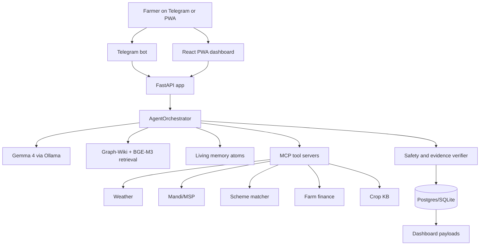
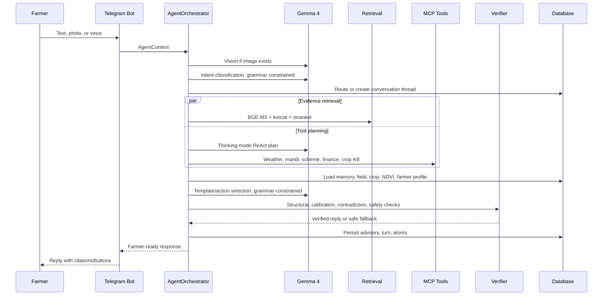
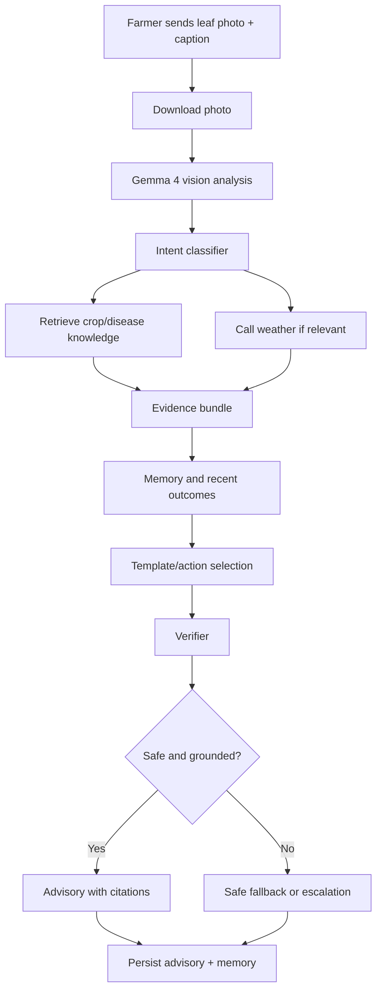
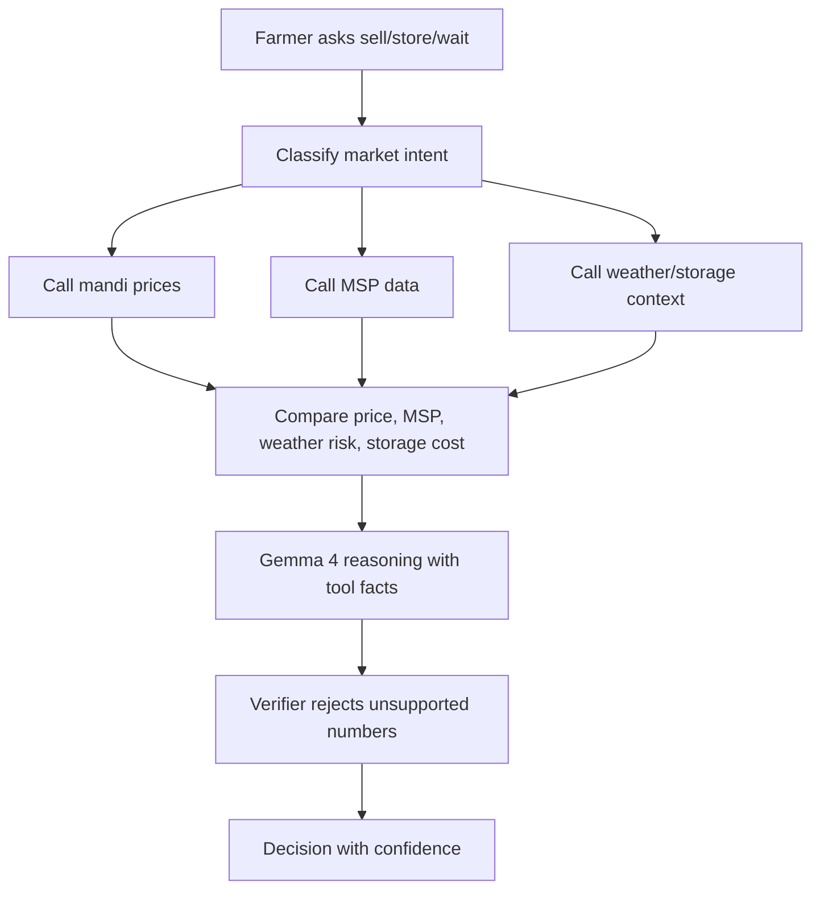
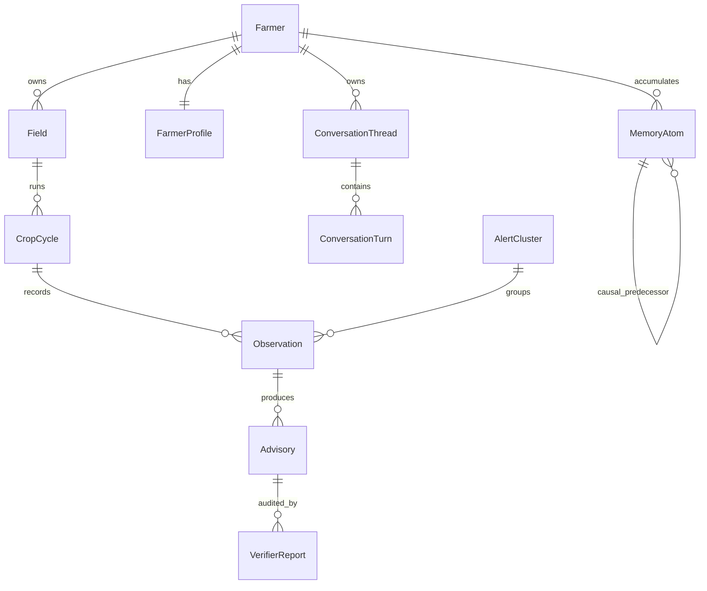
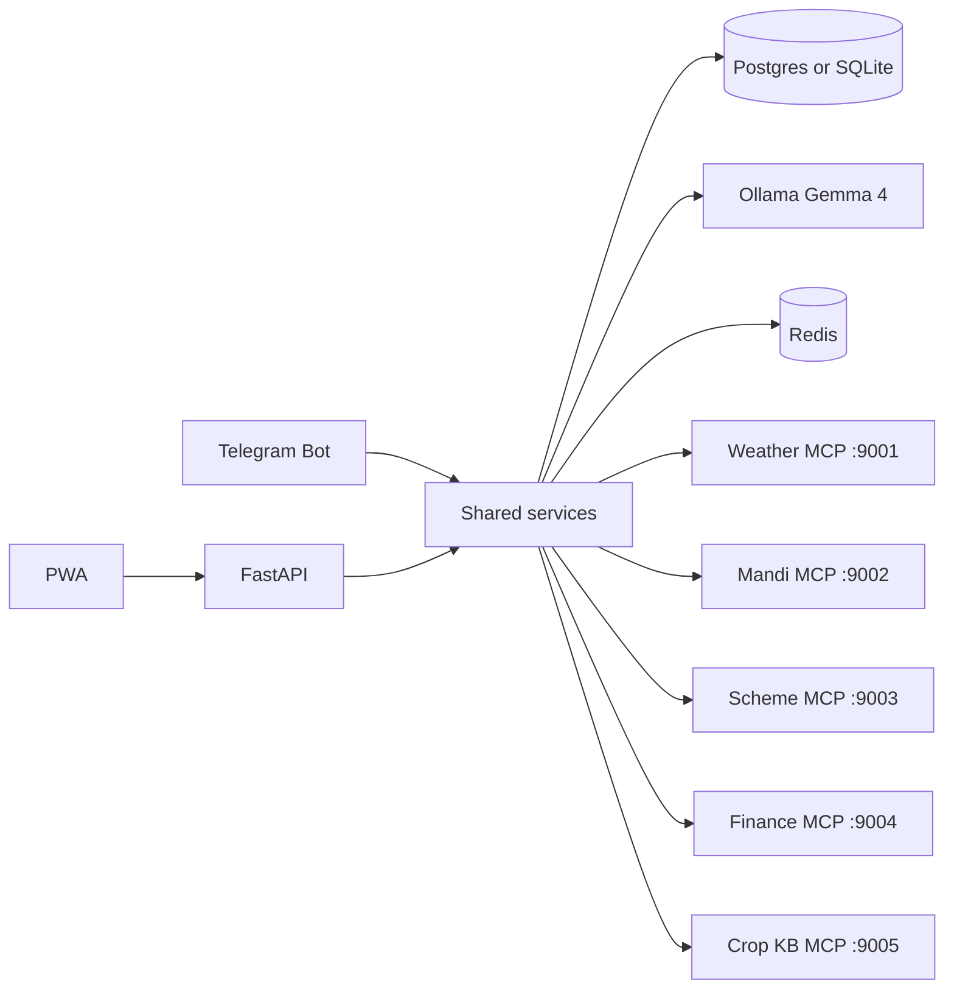
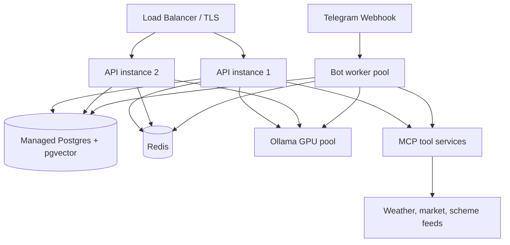

# AgriMesh

**An evidence-based Gemma 4 agricultural intelligence agent for the full farming decision loop. The more farmers use it, the more useful its local memory becomes.**

AgriMesh is built for the Kaggle Gemma 4 Good Hackathon as a working proof-of-concept for smallholder agriculture. It turns a familiar chat surface, Telegram, and a React PWA dashboard into one grounded agricultural assistant for crop health, weather-aware planning, mandi and MSP context, scheme discovery, farm finance, outbreak intelligence, and farmer-owned memory.

The core idea is simple and ambitious: farmers should not need five different tools to answer one field decision. They should be able to send text, voice, or a crop photo; AgriMesh classifies the intent, retrieves crop evidence, calls live tool servers, checks safety, remembers outcomes, and replies in the farmer's language with confidence, citations, and next actions.

AgriMesh does not replace certified agronomists, KVK officers, pesticide labels, or local authorities. It is a first-line decision support layer that is designed to be transparent, cautious, and escalatory when uncertainty or chemical safety risk appears.

## Table Of Contents

1. [Why AgriMesh Matters](#why-agrimesh-matters)
2. [The Product Thesis](#the-product-thesis)
3. [Evidence And Public Value](#evidence-and-public-value)
4. [System Overview](#system-overview)
5. [How Gemma 4 Powers The Agent](#how-gemma-4-powers-the-agent)
6. [The Advisory Pipeline](#the-advisory-pipeline)
7. [Feature Inventory](#feature-inventory)
8. [Farmer Workflows](#farmer-workflows)
9. [Architecture](#architecture)
10. [Engineering Details](#engineering-details)
11. [Commands, Buttons, And PWA Surface](#commands-buttons-and-pwa-surface)
12. [API Reference](#api-reference)
13. [Run Locally](#run-locally)
14. [Production Path](#production-path)
15. [Security, Privacy, And Responsible AI](#security-privacy-and-responsible-ai)
16. [Evaluation And Testing](#evaluation-and-testing)
17. [Troubleshooting](#troubleshooting)
18. [Sources](#sources)

## Why AgriMesh Matters

Agriculture is not one problem. It is a chain of linked decisions: diagnosis, weather timing, input safety, market timing, scheme access, cash flow, and follow-up learning. For a smallholder farmer, a late or generic answer can mean avoidable crop loss, unnecessary chemical use, or a missed selling window.

AgriMesh positions Gemma 4 as the reasoning layer inside a practical agricultural operating system:

| Farmer Need | AgriMesh Response |
|---|---|
| A crop leaf looks diseased, but the farmer is unsure what to do. | Photo plus text diagnosis, Graph-Wiki retrieval, official IPM/manual evidence, confidence labels, verifier, and follow-up memory. |
| Market, MSP, weather, and storage decisions arrive together. | Mandi and MSP tools, weather context, sell/store reasoning, and dashboard history. |
| Government schemes are hard to match to a specific farmer profile. | Scheme matching uses profile, crop, and location data to surface relevant seed scheme data. |
| Farm finances are scattered across memory and paper. | Expenses and sales roll into active-cycle profit and loss. |
| Nearby farmers see the same pest or disease, but the signal spreads slowly. | Privacy-gated memory atoms, k-anonymous cross-farmer learning, and outbreak alerts across village, pincode, tehsil, and district. |

This is why AgriMesh is more than a chatbot. It is an evidence-checked agent with tools, memory, and a safety verifier. Each advisory can become part of a learning loop: observation -> evidence -> action -> outcome -> stronger future context.

## The Product Thesis

**One agent. One accessible interface. Every common farming question handled with evidence, memory, and local context.**

The farmer should not need to know whether their question belongs to plant pathology, weather, finance, schemes, or market intelligence. A farmer can ask:

```text
धान के पत्ते पर भूरे धब्बे हैं, क्या करूं?
```

AgriMesh is designed to answer with:

- a likely risk hypothesis, not false certainty;
- immediate non-harmful actions;
- evidence-grounded reasoning;
- warnings when pesticide, dosage, or severe-disease escalation is unsafe;
- memory-aware follow-up;
- a dashboard trail for review;
- citations and confidence language.

The long-term vision is a local-first agricultural intelligence layer that can expand across crops, languages, and countries by changing the knowledge pack and tool servers while keeping the Gemma 4 orchestration, memory, verifier, and dashboard architecture.

## Evidence And Public Value

The need is measurable, and the public-good case is strong.

| Evidence | Why It Matters For AgriMesh |
|---|---|
| FAO reports that small family farmers produce around one-third of the world's food, while farms under one hectare are about 70% of all farms and operate only about 7% of agricultural land. | Small farms carry food-system importance despite limited land and capital, so low-cost advisory can have outsized value. |
| FAO/IPPC reports that plant pests can destroy up to 40% of global crop production annually and cause large trade and economic losses. | Early pest and disease detection is a high-leverage use case, especially when connected to local outbreak signals. |
| India's Agriculture Census 2015-16 reports that small and marginal holdings form about 86% of operational holdings. | The core Indian user is land-constrained; advice must improve timing, risk, input efficiency, and market access without assuming high capital. |
| Research on digital agricultural advice notes that many farmers have weak access to science-based extension, with farmer-to-extension-worker ratios often above 1000:1 in many LMIC contexts. | AI can scale routine triage and reserve scarce human extension capacity for hard or high-risk cases. |
| WRI summarizes evidence that digital climate-informed advisory services can improve productivity and resilience, with high returns when services are localized and acted upon. | AgriMesh combines weather, crop stage, memory, and market context instead of issuing generic advice. |

Expected public value:

| Level | Impact |
|---|---|
| Farmer | Better disease triage, safer pesticide behavior, improved market decisions, clearer scheme eligibility, and field-specific memory. |
| Household | Lower avoidable crop loss, reduced unnecessary chemical use, improved income predictability, and more confidence with buyers or officers. |
| Community | Outbreak intelligence, aggregated climate-risk signals, anonymized research data, and better allocation of extension-worker attention. |

The same evidence that makes AgriMesh exciting also makes safety essential. Bad agricultural advice can waste money, harm applicators, damage soil and water, or spread false confidence. AgriMesh therefore uses retrieval, official manuals, grammar-constrained model output, a verifier, confidence language, and escalation rules.

## System Overview



| Runtime Process | File | Role |
|---|---|---|
| FastAPI app | `app/main.py` | REST API, PWA serving, health checks, model metadata, dashboard data, cluster review, eval outputs. |
| Telegram bot | `app/bot/telegram_bot.py` | Farmer interface for commands, onboarding, text/photo/voice handlers, buttons, and dashboard links. |
| Agent orchestrator | `app/services/agent.py` | Main advisory pipeline. |
| Ollama client | `app/utils/ollama_client.py` | Gemma 4 calls, grammar-constrained schemas, fallback model, capability logging. |
| MCP servers | `app/mcp_servers/*.py` | Weather, mandi, scheme, finance, and crop knowledge tools. |
| PWA | `pwa/src/main.jsx` | Dashboard, market, weather, Gemma capability proof, history, and settings. |

## How Gemma 4 Powers The Agent

AgriMesh uses Gemma 4 as the agentic reasoning center, but it deliberately prevents the model from becoming an unchecked free-text authority.

| Gemma 4 Capability | Implementation | Farmer Value |
|---|---|---|
| Thinking mode | `OllamaClient.chat(..., thinking=True)` prepends the native thinking token for ReAct planning. | More deliberate tool choice for complex sell/store, outbreak, scheme, and crop-health questions. |
| Function calling | `plan_tools()` emits schema-bound tool calls; `AgentOrchestrator._execute_tool()` dispatches to MCP servers. | Weather, mandi, MSP, finance, and scheme facts come from tools rather than unsupported generation. |
| Multimodal vision | `analyze_crop_photo()` sends crop images to Gemma 4 and logs `multimodal` capability events. | Farmers can show a diseased leaf instead of describing lesions precisely. |
| Grammar-constrained decoding | JSON schemas in `app/schemas/` are passed through Ollama's `format` field. | Intent, tool plans, safety checks, templates, and cluster summaries return structured fields. |
| Multilingual output binding | `_language_directive()` binds replies to English or a selected Indic language plus English block where appropriate. | Farmers can use Hindi, English, or supported Indic-language preferences while operators retain traceability. |
| Local inference | Ollama hosts `gemma4:e4b` primary and `gemma4:e2b` fallback. | Lower per-query cloud cost by default and improved data sovereignty. |

Live Gemma 4 capability proof is exposed through:

- `GET /api/v1/capabilities`
- PWA route `/gemma4`
- Telegram advisory footer when enabled
- in-process ring buffer in `app/services/capability_log.py`

## The Advisory Pipeline



`app/services/agent.py` coordinates the loop:

1. Hydrate farmer, field, location, and land context.
2. Run Gemma 4 vision for images.
3. Load conversation context.
4. Classify intent with grammar-constrained JSON.
5. Route the conversation thread.
6. Fire speculative retrieval.
7. Plan and execute tools with thinking mode.
8. Load memory, profile, and NDVI context.
9. Select actions and templates with structured output.
10. Verify safety, evidence, confidence, and contradictions.
11. Format citations and confidence.
12. Persist advisory, verifier report, memory atoms, and conversation turn.

## Feature Inventory

| Feature | Logic | Main Files |
|---|---|---|
| Text advisory | Free text flows through intent classification, retrieval, tool planning, memory, template selection, verifier, and persistence. | `app/bot/telegram_bot.py`, `app/services/agent.py` |
| Photo diagnosis | Telegram photo is downloaded, passed to Gemma 4 vision, and used as advisory context. | `handle_photo`, `OllamaClient.analyze_crop_photo` |
| Voice loop | OGG/audio is saved; Sarvam STT/TTS can transcribe, translate, synthesize, and degrade to text fallback. | `app/services/voice.py`, `handle_voice` |
| Farmer registration | Multi-step state machine captures name, phone, district, pincode, tehsil, village, field, soil, crop, sowing date, and crop stage. | `telegram_bot.py` registration handlers |
| Field and crop cycles | Farmers can create and switch fields and crop cycles; crop stage can be inferred from LLM intent and written back. | `models.py`, `telegram_bot.py`, `agent.py` |
| Graph-Wiki RAG | Dense retrieval, lexical boost, cross-encoder rerank, top evidence articles, and previous-advisory bias for follow-ups. | `app/services/retrieval.py` |
| Living memory | Memory atoms use temporal decay, causal predecessors, outcome boosts, privacy scopes, and redaction support. | `app/services/memory.py`, `models_memory.py` |
| Cross-farmer learning | Similar-farm context is returned only after k-anonymity is satisfied. | `retrieve_similar_farm_context` |
| Outbreak warning | Negative outcomes or pest/disease reports cascade from village to pincode to tehsil to district; threshold is 10% with a 2-reporter floor. | `app/services/outbreak.py` |
| Market intelligence | Mandi prices, MSP context, sell/store logic, and market history are available to the agent and dashboard. | `app/services/mandi.py`, `market_intel.py`, `mcp_servers/mandi_server.py` |
| Finance | Expenses and sales roll into active-cycle profit and loss. | `finance.py`, Telegram `/expense`, `/sale`, `/finance` |
| Scheme matching | Farmer profile and crop/location data are matched against seed scheme data. | `scheme.py`, `mcp_servers/scheme_server.py` |
| Verifier | Checks structural index validity, memory contradiction, evidence calibration, and pesticide safety. | `app/services/verifier.py` |
| Degradation | If model or tools fail, the app falls back to cached data, deterministic templates, or safe fallback text. | `app/services/degradation.py`, `ollama_client.py` |
| Dashboard | Reads the same DB as the bot and shows farm, risks, evidence, tools, history, memory, and model capability proof. | `pwa/src/main.jsx`, `farmer_dashboard.py` |

## Farmer Workflows

### Registration

```mermaid
flowchart TD
    A[/start] --> B[Pick language]
    B --> C[/register]
    C --> D[Name]
    D --> E[Phone]
    E --> F[District]
    F --> G[Pincode]
    G --> H[Tehsil]
    H --> I[Village]
    I --> J[Field name and area]
    J --> K[Soil type button]
    K --> L[Crop name]
    L --> M[Sowing date]
    M --> N[Stage button]
    N --> O[Farmer can ask questions]
```

### Disease Or Pest Question



### Market Decision



### Outbreak Alert

```mermaid
flowchart TD
    A[/outcome worsened or no_change] --> B[Extract crop and threat]
    B --> C[Check recent reports in village]
    C --> D{Threshold crossed?}
    D -- No --> E[Try pincode]
    E --> F{Threshold crossed?}
    F -- No --> G[Try tehsil]
    G --> H{Threshold crossed?}
    H -- No --> I[Try district]
    I --> J{Threshold crossed?}
    D -- Yes --> K[Create AlertCluster]
    F -- Yes --> K
    H -- Yes --> K
    J -- Yes --> K
    K --> L[Notify relevant farmers]
    K --> M[Write public outbreak memory atom]
    J -- No --> N[No alert]
```

## Architecture

### Repository Map

```text
AgentAgri/
  app/
    main.py                  FastAPI app, middleware, API routes, PWA serving
    config.py                Environment settings and production validation
    database.py              Async SQLAlchemy engine/session
    models.py                Core farmer, field, crop, observation, advisory models
    models_memory.py         Memory atoms, conversation threads, turns
    api/v1/auth.py           Demo dashboard sessions
    bot/telegram_bot.py      Telegram command, callback, media handlers
    mcp_servers/             Weather, mandi, scheme, finance, crop KB servers
    schemas/                 JSON schemas for constrained model output
    services/                Agent, memory, retrieval, evidence, dashboard, market, finance, alerts
    utils/                   Ollama client, safety, security, time
  alembic/                   Database migrations
  data/seed/                 Seed prices, schemes, weather, memory, KB sections
  data/reference/            Runtime knowledge assets and official manuals
  evals/                     Golden datasets and scorecard outputs
  pwa/                       React/Vite dashboard
  scripts/                   Seed, smoke, readiness, scoring utilities
  tests/                     Pytest suite
  wiki/articles/             Graph-Wiki article seed corpus
```

### Data Model



### Process Topology



## Engineering Details

### Retrieval

The retrieval stack is hybrid by design:

| Layer | Purpose |
|---|---|
| BGE-M3 dense retrieval | Finds semantically related crop, pest, scheme, and agronomy content. |
| Lexical boost | Favors explicit crop, title, and topic-tag matches. |
| BGE reranker | Promotes the best final evidence cards. |
| Previous article bias | Keeps follow-up questions anchored to the last advisory. |
| Universal KB | Adds common issue memory and official reference manuals. |

### Verifier

The verifier is the safety gate between model output and farmer action.

| Check | Action |
|---|---|
| Structural | Ensures selected action and warning indices resolve to actual evidence. |
| Memory contradiction | Detects when advice conflicts with a recent completed action or outcome. |
| Calibration | Prevents HIGH confidence unless evidence richness and recency justify it. |
| Safety | Redirects unsafe pesticide, dosage, re-entry, and banned-chemical advice to safe fallback. |

### Memory

Memory is a structured graph of facts and outcomes, not a raw chat dump.

| Mechanism | Use |
|---|---|
| M1 temporal decay | Recent pest, weather, and market facts matter more than stale facts. |
| M2 outcome boost | Advice that worked becomes stronger future evidence; failed advice is downgraded. |
| M3 causal chain | Observation -> vision -> advisory -> outcome can be audited. |
| M4 k-anonymous learning | Other farms help only after privacy thresholds are met. |

### Configuration

| Variable | Purpose |
|---|---|
| `APP_ENV` | `development`, `test`, `demo`, or `production`; production validates secrets and disables unsafe defaults. |
| `DATABASE_URL` | SQLite for dev or `postgresql+asyncpg://...` for production. |
| `OLLAMA_HOST` | Ollama daemon URL. |
| `OLLAMA_MODEL` | Primary model, default `gemma4:e4b`. |
| `OLLAMA_FALLBACK_MODEL` | Fallback model, default `gemma4:e2b`. |
| `USE_GRAMMAR_DECODING` | Enables schema-constrained output. |
| `TELEGRAM_BOT_TOKEN` | Telegram bot token from BotFather. |
| `AGRIMESH_API_KEY` | API key for protected routes. |
| `AGRIMESH_REQUIRE_API_KEY` | Force API key checks outside production. |
| `REDIS_URL` | Rate limiting and session backing store. |
| `SARVAM_API_KEY` | Optional voice pipeline provider key. |
| `WEATHER_API_KEY` | Optional live weather key. |

## Commands, Buttons, And PWA Surface

### Telegram Commands

| Command | What It Does |
|---|---|
| `/start` | Opens language/welcome flow and shows resume, new, register, demo, and help buttons. |
| `/help` | Lists available bot commands. |
| `/demo` | Activates demo farmer data when demo secrets allow it. |
| `/architecture` | Shows system and Gemma capability overview in chat. |
| `/register` | Starts farmer onboarding. |
| `/profile` | Shows or captures farm profile fields. |
| `/field`, `/fields`, `/usefield` | Create, list, and switch fields. |
| `/crop`, `/crops`, `/usecrop`, `/newcycle`, `/closecycle` | Manage crop cycles. |
| `/tasks`, `/calendar` | Show stage-aware tasks and upcoming crop actions. |
| `/prices` | Fetches mandi and MSP context. |
| `/expense`, `/sale`, `/finance` | Logs farm finance and shows active-cycle profit and loss. |
| `/memory`, `/mydata`, `/forgetme` | Shows field memory, raw data digest, and redaction path. |
| `/edit` | Starts profile/location edit flow. |
| `/dashboard` | Returns a signed or direct dashboard link. |
| `/why`, `/sources` | Shows evidence trace and source list for the latest advisory. |
| `/feedback`, `/outcome` | Captures rating, comment, and whether advice worked. |
| `/health` | Reports bot, model, database, and MCP health. |
| `/threads`, `/newthread`, `/endthread` | Manage conversation threads. |
| `/voice_lang`, `/voice_reply` | Configure voice language and reply mode. |

### Telegram Buttons

| Button Family | Effect |
|---|---|
| Language picker | Sets UI/reply language and sends localized welcome. |
| Continue/New/Threads | Lists, switches, archives, or creates conversation threads. |
| Photo + Voice diagnose | Prompts the farmer to send an image or voice question. |
| Prices & MSP | Runs market price flow. |
| My data | Runs farmer-owned data digest. |
| Register, soil, and stage buttons | Complete onboarding and crop setup. |
| Evidence and Verified/Safe Advice | Shows evidence cards and verifier report. |
| Finance buttons | Opens expense, sale, and finance paths. |
| Forget me confirm/cancel | Confirms or cancels redaction. |
| Edit field buttons | Selects a profile/location field to edit. |
| Dashboard link | Opens the PWA. |

### PWA Navigation

| UI Element | What It Does |
|---|---|
| Dashboard | Farm overview, readiness, latest advisory, source count, impact count. |
| Crop Analysis | Active crop, NDVI mini-chart, stage, area, vision panel, crop tasks. |
| Market Prices | Mandi price rows and MSP-related market data. |
| Weather | Forecast cards from dashboard/weather API. |
| AI Advisor | Model metadata, reasoning trace, tool calls, and citations. |
| Gemma 4 | Capability proof cards for thinking, function calls, multimodal, grammar, and multilingual behavior. |
| History | Prior advisories with risk, confidence, actions, and warnings. |
| Settings | Runtime health, environment, model config, and evidence registry. |

### Makefile Commands

| Command | Purpose |
|---|---|
| `make help` | Shows command list. |
| `make install` | Installs Python dependencies. |
| `make setup` / `make seed` | Seeds database/demo data. |
| `make load-wiki` | Loads wiki articles. |
| `make test`, `make test-e4b`, `make test-retrieval`, `make test-agent` | Runs focused and full tests. |
| `make eval` | Runs evaluation harness. |
| `make lint` / `make format` | Runs Ruff checks and formatting. |
| `make migrate`, `make migrate-down`, `make migrate-revision MSG="..."` | Manages Alembic migrations. |
| `make run-bot`, `make run-api` | Starts bot and API. |
| `make demo-check` | Runs demo readiness checks. |
| `make run-mcp-weather`, `make run-mcp-mandi`, `make run-mcp-scheme`, `make run-mcp-finance` | Starts MCP tool servers. |
| `make pwa-build` | Installs/builds the PWA. |
| `make demo` | Seeds and starts API demo. |
| `make pull-model` | Pulls Gemma 4 models through Ollama. |
| `make check-vram` | Shows NVIDIA VRAM usage if available. |
| `make clean` | Removes generated local runtime files. |

## API Reference

Protected `/api/*` routes require `X-AgriMesh-API-Key` when `APP_ENV=production` or `AGRIMESH_REQUIRE_API_KEY=true`.

| Endpoint | Purpose |
|---|---|
| `GET /health` | Basic health, version, model, grammar flag, and environment. |
| `GET /api/health/degradation` | Degradation level and dependency health. |
| `POST /api/auth/demo-session` | Creates demo dashboard session. |
| `GET /api/clusters` and `GET /api/clusters/{cluster_id}` | Lists alert clusters and cluster detail. |
| `POST /api/clusters/{cluster_id}/review` | Approves, rejects, or broadcasts cluster review. |
| `GET /api/farmers/{farmer_id}/advisories` | Advisory history. |
| `GET /api/farmer-dashboard?farmer_id=...` | Full dashboard payload. |
| `GET /api/v1/dashboard/{token}` | Signed dashboard payload. |
| `GET /api/v1/capabilities` | Gemma 4 capability proof snapshot. |
| `GET /api/demo/architecture` | Demo architecture payload. |
| `PUT /api/farmers/{farmer_id}/profile` | Updates farmer profile. |
| `GET /api/farmers/{farmer_id}/conversation` | Conversation thread and turns. |
| `GET /api/advisories/{advisory_id}/impact-network` and `GET /api/impact-network` | Advisory impact graph and recent impact nodes. |
| `GET /api/eval/latest` and `GET /api/eval/history` | Evaluation outputs. |
| `GET /api/stats` | Aggregate counts. |
| `GET /api/models` | Current and fallback model metadata. |
| `GET /api/weather/forecast` | Forecast/history wrapper. |
| `GET /api/market-prices` | Market/MSP wrapper. |
| `GET /api/ai/showcase` | Latest advisory, reasoning trace, tools, and citations. |
| `GET /api/memory/summaries` | Aggregated memory summaries. |
| `GET /api/sources` | Evidence source registry. |

## Run Locally

### Prerequisites

| Component | Recommended |
|---|---|
| Python | 3.11+ |
| Node | 20+ for PWA development |
| Docker | Docker Desktop or Docker Engine with Compose |
| Ollama | Installed locally, listening at `http://localhost:11434` |
| RAM | 16 GB+ for smoother local model use |
| GPU | Optional; NVIDIA GPU improves Ollama latency |
| Telegram | Bot token from BotFather if using the bot |

### Option A: Docker Compose

```powershell
git clone https://github.com/Utkarsh-Sinha0/AgentAgri.git
cd AgentAgri
copy .env.example .env
ollama pull gemma4:e4b
ollama pull gemma4:e2b
docker-compose build
docker-compose up
```

Open:

- PWA/API: `http://localhost:8000`
- Health: `http://localhost:8000/health`
- OpenAPI in development: `http://localhost:8000/docs`

Set `TELEGRAM_BOT_TOKEN` in `.env` before starting Compose if you want Telegram live.

### Option B: Local Python

```powershell
git clone https://github.com/Utkarsh-Sinha0/AgentAgri.git
cd AgentAgri
python -m venv venv
.\venv\Scripts\activate
pip install -r requirements.txt
copy .env.example .env
ollama pull gemma4:e4b
ollama pull gemma4:e2b
alembic upgrade head
python scripts/seed_data.py
python -m uvicorn app.main:app --host 0.0.0.0 --port 8000 --reload
```

Optional processes in separate terminals:

```powershell
python -m app.bot.telegram_bot
python -m app.mcp_servers.weather_server
python -m app.mcp_servers.mandi_server
python -m app.mcp_servers.scheme_server
python -m app.mcp_servers.finance_server
python -m app.mcp_servers.crop_kb_server
```

### PWA Development

```powershell
cd pwa
npm install
npm run dev
```

For production serving:

```powershell
cd pwa
npm run build
```

FastAPI serves the built frontend when `pwa/dist` exists.

### Demo Farmer

The seed flow creates demo data such as a Bihar rice farmer, fields, memory palace, crop calendar, prices, schemes, and reference data. Use `/demo` in Telegram when demo mode and secrets are configured, or load the dashboard with a demo session/token.

## Production Path



Production checklist:

| Area | Requirement |
|---|---|
| Runtime | `APP_ENV=production`. |
| Database | Use Postgres/pgvector, not SQLite. |
| Secrets | Strong `AGRIMESH_API_KEY`; production Telegram token; no demo secrets. |
| Hosts | Strict `ALLOWED_ORIGINS` and `ALLOWED_HOSTS`; never `*`. |
| Model | Dedicated Ollama hosts or GPU pool; keep `OLLAMA_KEEP_ALIVE=-1`. |
| Fallback | Pull both primary and fallback Gemma 4 models. |
| Workers | Run API, bot, and MCP services as separate supervised processes. |
| Rate limiting | Redis available and monitored. |
| Logs | Structured stdout logs shipped to central log store. |
| Backups | Automated Postgres backups and restore drills. |
| Privacy | `/mydata` and `/forgetme` remain enabled; aggregate exports must be k-anonymous. |
| Safety | Verifier cannot be disabled in production. |
| Observability | Health, degradation, latency, model fallback, tool error, and alert metrics. |

Scaling happens across chat/API workers, Ollama GPU nodes, crop/country knowledge packs, and regional data partitions with k-anonymity gates.

## Security, Privacy, And Responsible AI

| Control | Implementation |
|---|---|
| Farmer raw data isolation | `/mydata` shows only the farmer's own memory and records. |
| Right to redact | `/forgetme` soft-redacts own raw memory atoms while preserving already coarsened aggregate summaries. |
| Aggregation privacy | Cross-farmer memory and outbreak intelligence use minimum farmer counts. |
| API auth | `X-AgriMesh-API-Key` in production or when required. |
| Password safety | Argon2 hashing in `app/utils/security.py`. |
| Config fail-fast | Production rejects placeholder API keys, SQLite, wildcard CORS, demo mode, and missing Telegram token. |
| Chemical safety | Pesticide advice is checked and escalated rather than blindly generated. |
| Evidence discipline | Official manuals, wiki articles, tool outputs, and memory atoms form evidence bundles. |
| Model fallback | Fallback model and deterministic safe replies avoid blank failures. |

The intended responsible behavior is clear: cite or hedge, escalate when uncertain, never expose another farmer's raw details, and never fabricate market, scheme, or weather numbers.

## Evaluation And Testing

Run tests:

```powershell
python -m pytest tests -v
```

Focused checks:

```powershell
python -m pytest tests/test_e4b_grammar.py -v
python -m pytest tests/test_retrieval.py -v
python -m pytest tests/test_outbreak_warning.py -v
python scripts/demo_readiness_check.py
python scripts/run_farmer_scorecard.py
```

The test suite covers API security, config validation, async blockers, authentication/demo sessions, conversation routing, dashboard payload shape, evidence citations, grammar-constrained output, memory M1-M4 behavior, migrations, MCP startup, outbreak warnings, retrieval, seeded dates, and Telegram flows.

## Troubleshooting

| Symptom | Likely Cause | Fix |
|---|---|---|
| `Connection refused localhost:11434` | Ollama not running. | Start Ollama and pull Gemma 4 models. |
| `model not found` | Model tag missing locally. | `ollama pull gemma4:e4b` and `ollama pull gemma4:e2b`. |
| Bot silent | Missing/wrong token or bot process not running. | Set `TELEGRAM_BOT_TOKEN`; run `python -m app.bot.telegram_bot`. |
| API 401 | API key required. | Set `AGRIMESH_API_KEY` and send `X-AgriMesh-API-Key`. |
| Dashboard has no farmer | No `farmer_id`, no signed token, or seed not loaded. | Run seed script or use `/dashboard` from Telegram. |
| MCP data missing | Tool server not running or port mismatch. | Start all `app.mcp_servers.*` processes or Compose services. |
| Slow first reply | Model cold load. | Set `OLLAMA_KEEP_ALIVE=-1`; keep model warm. |
| Voice fallback text only | `SARVAM_API_KEY` absent or voice pipeline disabled. | Configure Sarvam vars and enable voice pipeline. |
| Production startup fails | Config validator rejected unsafe setting. | Read error, replace placeholders, use Postgres, strict hosts/origins. |

## Sources

These public sources support the problem framing and impact logic. Product-specific behavior is derived from this repository's code.

1. FAO, "Small family farmers produce a third of the world's food", 23 April 2021: https://www.fao.org/newsroom/detail/small-family-farmers-produce-a-third-of-the-world-s-food/en
2. FAO, "How plant diseases threaten global food security": https://www.fao.org/one-health/highlights/how-plant-diseases-threaten-global-food-security/en
3. FAO, "Climate change fans spread of pests and threatens plants and crops", 2 June 2021: https://www.fao.org/newsroom/detail/Climate-change-fans-spread-of-pests-and-threatens-plants-and-crops-new-FAO-study/
4. Government of India, Directorate of Economics and Statistics, Agriculture Census Scheme: https://desagri.gov.in/programs-schemes/agriculture-census-scheme/
5. Government of India Press Information Bureau, categorisation and Agriculture Census references, 5 February 2019: https://www.pib.gov.in/PressReleasePage.aspx?PRID=1562687
6. Fabregas, Kremer, and Schilbach, "Realizing the potential of digital development: The case of agricultural advice", Science/PMC: https://pmc.ncbi.nlm.nih.gov/articles/PMC10859166/
7. World Resources Institute, "To Tackle Food Insecurity, Invest in Digital Climate Services for Agriculture": https://www.wri.org/insights/tackle-food-insecurity-invest-digital-climate-services-agriculture
8. GSMA, Digital Agriculture Maps: https://www.gsma.com/digital-agriculture-maps/
