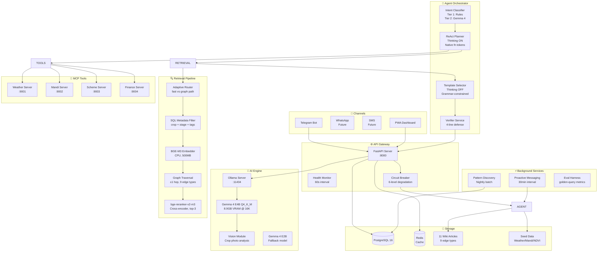
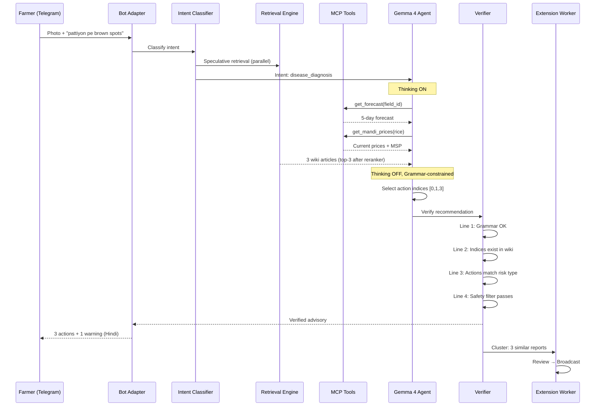
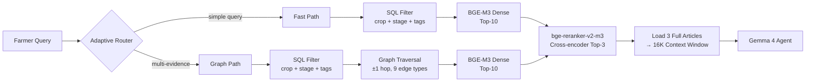
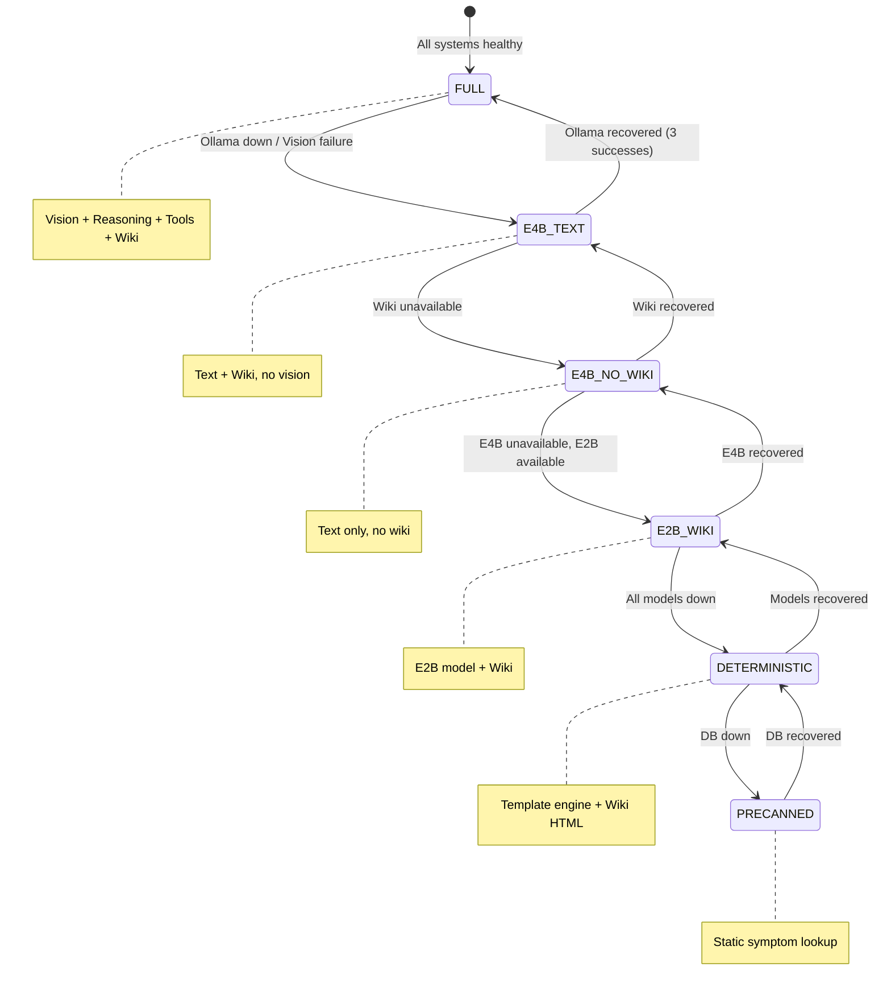
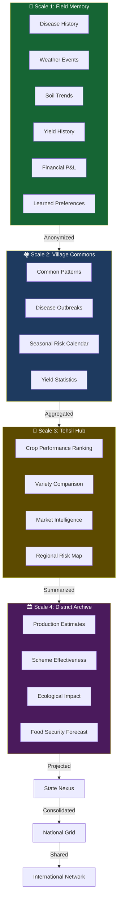

# 🌾 AgriMesh V4.0

> **AI Agricultural Intelligence Agent for Smallholder Farmers**
>
> Gemma 4 E4B · Graph-Wiki RAG · MCP Tools · Grammar-Constrained Decoding · Telegram/PWA

[](LICENSE)
[](https://python.org)
[](tests/)
[](https://kaggle.com)

---

## 📖 Table of Contents

1. [Problem & Mission](#1-problem--mission)
2. [What AgriMesh Does](#2-what-agrimesh-does)
3. [Architecture](#3-architecture)
4. [Quick Start](#4-quick-start)
5. [Project Structure](#5-project-structure)
6. [AI Engine](#6-ai-engine)
7. [Retrieval System](#7-retrieval-system)
8. [Agent Orchestrator](#8-agent-orchestrator)
9. [Anti-Hallucination](#9-anti-hallucination)
10. [Safety System](#10-safety-system)
11. [Memory Palace](#11-memory-palace)
12. [MCP Tools](#12-mcp-tools)
13. [Channels](#13-channels)
14. [Alert & Cluster System](#14-alert--cluster-system)
15. [Financial Tracking](#15-financial-tracking)
16. [Market Intelligence](#16-market-intelligence)
17. [Degradation Ladder](#17-degradation-ladder)
18. [Evaluation Harness](#18-evaluation-harness)
19. [API Reference](#19-api-reference)
20. [Demo Script](#20-demo-script)
21. [Competition Tracks](#21-competition-tracks)
22. [Roadmap](#22-roadmap)
23. [Contributing](#23-contributing)

Detailed handoff documents:

- [Product pitch and use cases](PRODUCT_PITCH_AND_USE_CASES.md)
- [Developer spec and tester README](DEVELOPER_SPEC_AND_TESTER_README.md)

---

## 1. Problem & Mission

### The Problem

> **500 million smallholder farmers** worldwide lose **20-30% of their yield** to preventable diseases, pests, and poor decision-making. In India alone, 86% of farmers are smallholders (<2 hectares). They lack access to:
> - Timely, accurate crop disease diagnosis
> - Weather-contextualized advice
> - Fair market prices (often selling 20-40% below MSP)
> - Government scheme awareness (PM-KISAN, PMFBY, KCC, SHC)
> - Extension worker support (1 extension worker per 5,000+ farmers in Bihar)

### The Mission

AgriMesh is a **local-first, AI-powered agricultural intelligence agent** that puts expert-level crop advisory into the hands of every farmer — on the device they already own. No app store. No cloud dependency. No internet required (beyond Telegram).

### Global Resilience Track

AgriMesh competes in the **Global Resilience** track of the Kaggle Gemma 4 Good Hackathon. It addresses **SDG 2 (Zero Hunger)**, **SDG 1 (No Poverty)**, and **SDG 13 (Climate Action)** by:
- Reducing preventable crop losses through early disease detection
- Improving farmer income through market intelligence and scheme matching
- Building climate resilience through localized, evidence-grounded advice

---

## 2. What AgriMesh Does

```
Farmer sends crop photo + "pattiyon pe brown spots hain"
                    ↓
    ┌───────────────────────────────────────┐
    │  1. Vision: Gemma 4 analyzes photo    │
    │  2. Speculative Retrieval fires       │
    │  3. MCP Weather + Mandi tools called  │
    │  4. Graph-Wiki surfaces 3 articles    │
    │  5. Agent picks action indices        │
    │  6. Verifier checks 4-line defense    │
    │  7. Advisory delivered in Hindi       │
    └───────────────────────────────────────┘
                    ↓
Farmer receives: 3 actions + 1 warning + evidence + memory reference
Extension worker sees: Cluster of 3 similar reports in Munger Block
```

### Core Capabilities

| Capability | How It Works |
|---|---|
| 🖼️ **Crop Disease Detection** | Gemma 4 Vision analyzes leaf photos, identifies symptoms, estimates severity |
| 🧠 **Risk Reasoning** | Configurable thinking mode weighs 6 evidence signals before recommending |
| 🌦️ **Weather Integration** | 5-day forecast + 7-day history via MCP weather server |
| 🏪 **Market Prices** | Mandi prices + MSP comparison + FCI procurement directory |
| 📋 **Scheme Matching** | PM-KISAN, PMFBY, KCC, SHC, PKVY eligibility assessment |
| 💰 **Farm Finance** | Expense tracking, revenue logging, automated P&L calculation |
| 🚨 **Community Alerts** | 6-factor similarity clustering across farms, extension worker review |
| 🧠 **Memory Palace** | 7-scale hierarchical memory: Field → Village → Tehsil → District → State → National → International |
| 📱 **Telegram Bot** | Slash commands, photo upload, structured data capture, farmer dashboard deep link |
| 🖥️ **PWA Dashboard** | Personalized farmer dashboard plus extension worker cluster review, eval metrics, memory visualization |

---

## 3. Architecture

### System Architecture Diagram



### Agent Workflow (ReAct + Selection)



### Retrieval Pipeline



### Degradation Ladder



### Memory Palace (7 Scales)



---

## 4. Quick Start

### Prerequisites

- Python 3.11+
- [Ollama](https://ollama.com) installed and running
- PostgreSQL 16 (or SQLite for dev)
- 12GB+ VRAM GPU (RTX 3060 or better) for Gemma 4 E4B

### One-Command Demo

```bash
# Clone and enter
git clone https://github.com/yourusername/agrimesh.git
cd agrimesh

# Create venv
python -m venv venv
source venv/bin/activate  # or venv\Scripts\activate on Windows

# Install dependencies
make install

# Pull the model
make pull-model
# This runs: ollama pull gemma4:e4b && ollama pull gemma4:e2b

# Seed the database
make seed

# Start everything
make demo
```

Visit:
- **API**: http://localhost:8000
- **API Docs**: http://localhost:8000/docs
- **PWA Dashboard**: http://localhost:8000 (after `cd pwa && npm install && npm run build`)
- **Health Check**: http://localhost:8000/health

### Individual Commands

```bash
make help          # Show all commands
make test          # Run 42 tests
make eval          # Run eval harness on golden queries
make run-bot       # Start Telegram bot only
make run-api       # Start FastAPI server only
make demo-check    # Verify demo memory palace + local Ollama status
make seed          # Seed database with demo data + wiki articles
make clean         # Clean generated files
```

### Telegram Demo Flow

For a judge-facing demo, use the one-command Telegram setup instead of manual registration:

```bash
ollama serve
ollama pull gemma4:e4b
python scripts/seed_data.py
python scripts/demo_readiness_check.py
python -m app.bot.telegram_bot
```

Then in Telegram:

1. Send `/demo` to bind the seeded Munger rice farm to your Telegram user.
2. Send `/memory` to show prior observations, outcomes, and NDVI trend.
3. Send `/prices` to show seeded mandi/MSP intelligence.
4. Send `/finance` to show the demo farm ledger.
5. Send `/dashboard` to open the farmer's personal web page with weather skin, field map clusters, NDVI, finance, memory, and advisories.
6. Send `pattiyon pe brown spots hain` or a crop photo to exercise local Gemma 4 advisory, retrieval, memory context, verifier, and evidence cards.

The demo memory palace is seeded from `data/seed/memory_palace.json`: soil-test history, brown-spot follow-up, stem-borer scouting, fungicide safety, mandi/MSP planning, farm expenses, NDVI history, and a community alert cluster.

### Environment Setup

Copy `.env.example` to `.env` and configure:

```env
OLLAMA_HOST=http://localhost:11434
OLLAMA_MODEL=gemma4:e4b
TELEGRAM_BOT_TOKEN=
DATABASE_URL=sqlite+aiosqlite:///./data/agrimesh.db
USE_GRAMMAR_DECODING=1
APP_ENV=development
ALLOWED_ORIGINS=http://localhost:8000,http://127.0.0.1:8000
ALLOWED_HOSTS=localhost,127.0.0.1
AGRIMESH_REQUIRE_API_KEY=false
# Generate with: python -c "import secrets; print(secrets.token_urlsafe(32))"
AGRIMESH_API_KEY=
AGRIMESH_DASHBOARD_BASE_URL=http://localhost:8000
```

For production, set `APP_ENV=production`, restrict `ALLOWED_ORIGINS` and `ALLOWED_HOSTS` to the deployed domains, and set a strong `AGRIMESH_API_KEY`. API routes then require `X-AgriMesh-API-Key`; `/health` remains unauthenticated for platform health checks.

### Production Readiness Checks

Current hardening gates verified locally:

```bash
python -m ruff check app tests scripts
python -m pytest tests/ -q
python -m pip install --dry-run -r requirements.txt
python -m pip check
python -m pip_audit -r requirements.txt
npm audit --prefix pwa --omit=dev
npm run build --prefix pwa
```

The backend adds trusted-host checks, restricted CORS, request-size limiting, API-key protection for `/api/*`, security response headers, production docs disablement, Argon2 password hashing, local SQLite schema repair for additive model changes, and graceful background-task shutdown. The PWA includes a restrictive CSP and sends `X-AgriMesh-API-Key` when configured in browser storage.

---

## 5. Project Structure

```
agrimesh/
├── app/
│   ├── main.py              # FastAPI entry point + lifespan
│   ├── config.py            # Pydantic settings (env vars)
│   ├── database.py          # Async SQLAlchemy engine + local SQLite schema repair
│   ├── models.py            # 12 SQLAlchemy models
│   ├── eval.py              # Golden-query eval harness
│   │
│   ├── schemas/             # JSON Schema for grammar-constrained decoding
│   │   ├── intent_classification.schema.json
│   │   ├── tool_call.schema.json
│   │   ├── template_selection.schema.json
│   │   ├── safety_check.schema.json
│   │   └── cluster_summary.schema.json
│   │
│   ├── services/            # 14 service modules
│   │   ├── agent.py         # Agent orchestrator (ReAct + Selection)
│   │   ├── retrieval.py     # BGE-M3 + reranker + graph traversal
│   │   ├── verifier.py      # 4-line anti-hallucination defense
│   │   ├── demo_seed.py     # Telegram demo memory-palace seeding
│   │   ├── degradation.py   # 6-level degradation ladder + circuit breaker
│   │   ├── alerts.py        # 6-factor similarity scoring + cluster lifecycle
│   │   ├── cluster.py       # Alert cluster CRUD + broadcast
│   │   ├── proactive.py     # 4-trigger proactive messaging
│   │   ├── pattern_discovery.py  # Nightly pattern detection
│   │   ├── market_intel.py  # Sell advisor + FCI directory
│   │   ├── weather.py       # Seeded weather data (IMD-compatible API)
│   │   ├── mandi.py         # Seeded mandi prices (agmarknet format)
│   │   ├── scheme.py        # 5 government schemes (PM-KISAN, etc.)
│   │   ├── finance.py       # Expense/revenue/P&L tracking
│   │   └── farmer_dashboard.py # Farmer profile, weather, map, money, memory payload
│   │
│   ├── mcp_servers/         # 4 FastMCP servers
│   │   ├── weather_server.py
│   │   ├── mandi_server.py
│   │   ├── scheme_server.py
│   │   └── finance_server.py
│   │
│   ├── bot/
│   │   └── telegram_bot.py  # Full Telegram bot (11 commands + photo)
│   │
│   └── utils/
│       ├── ollama_client.py # Gemma 4 client (grammar, thinking, vision)
│       ├── safety.py        # 2-stage safety filter (regex + LLM)
│       └── security.py      # Argon2id, rate limiter, privacy manager
│
├── wiki/articles/           # 11 Graph-Wiki articles (JSON)
│   ├── rice_blast.json
│   ├── rice_brown_spot.json
│   ├── stem_borer.json
│   ├── bacterial_leaf_blight.json
│   ├── wheat_rust.json
│   ├── nitrogen_excess.json
│   ├── potassium_deficiency.json
│   ├── water_management_rice.json
│   ├── fungicide_safety.json
│   ├── mandi_selling_guide.json
│   └── pm_kisan_guide.json
│
├── data/seed/               # Seed data (real API shapes)
│   ├── weather.json
│   ├── mandi_prices.json
│   ├── schemes.json
│   └── memory_palace.json   # Rich demo farm history + finance + NDVI
│
├── evals/
│   └── golden_queries.jsonl # 15 golden eval queries
│
├── tests/                   # 42 passing tests
│   ├── test_e4b_grammar.py  # Schema validation + safety + verifier
│   ├── test_retrieval.py    # SQL filter + keyword retrieval
│   ├── test_agent_e2e.py    # Agent pipeline with mocks
│   ├── test_api_security.py # API key, privacy, validation, degradation health
│   ├── test_conversation_impact.py # Conversations + impact graph
│   ├── test_demo_seed.py    # Demo memory-palace idempotency
│   └── test_farmer_dashboard.py # Personalized dashboard + profile upsert
│
├── pwa/                     # React PWA (farmer dashboard + extension console)
│   ├── src/main.jsx
│   ├── index.html
│   └── vite.config.js
│
├── scripts/
│   ├── seed_data.py         # Database seeder
│   ├── demo_readiness_check.py # Demo seed + Ollama status check
│   └── startup.sh           # Docker startup sequence
│
├── alembic/                 # Database migrations
├── Dockerfile
├── docker-compose.yml
├── pyproject.toml           # Ruff + pytest + coverage config
├── Makefile
└── README.md
```

---

## 6. AI Engine

### Model Choice: Gemma 4 E4B

| Parameter | Value | Justification |
|---|---|---|
| Model | **Gemma 4 E4B** Q4_K_M | 42.2% on Tau2 agentic benchmark (vs 24.5% for E2B) |
| Effective params | 4.5B | Sufficient for reasoning + tool calling |
| VRAM @ 16K | ~8.9 GB | Fits comfortably on 12 GB RTX 3060 |
| Context window | 16,384 tokens | 3-5 wiki articles + evidence + memory |
| Fallback | Gemma 4 E2B Q4_K_M | Zero code changes — just env var swap |

### Sampling (Google's Official Defaults)

```python
temperature = 1.0    # DO NOT lower — model was instruct-tuned for this
top_p = 0.95
top_k = 64
```

With **grammar-constrained decoding**, high temperature doesn't hurt — invalid tokens are masked at sample time. You get:
- Reasoning quality of temp=1.0
- Structural validity enforced by the grammar path and covered by tests
- ~25% accuracy improvement over unconstrained generation

### Native Gemma 4 Capabilities

| Capability | Token/Mechanism | Usage |
|---|---|---|
| Thinking Mode | `<\|think\|>` token | ON for risk reasoning, OFF for template selection |
| Function Calling | `<\|tool_call\|>`, `<\|tool_result\|>` | MCP-compatible tool boundary; the current agent calls local service adapters directly |
| Vision | Multimodal input | Crop photo analysis (280 tokens/image) |
| Multilingual | Native Hindi/English | Responses in farmer's preferred language |

### Grammar-Constrained Decoding

Every structured output uses JSON Schema passed to Ollama's `format` field:

```python
response = ollama.chat(
    model="gemma4:e4b",
    messages=[...],
    format=schema,  # llama.cpp GBNF grammar-constrained
)
```

Invalid JSON is **impossible to produce** at sample time. Five schemas cover every agent output:
- `intent_classification.schema.json`
- `tool_call.schema.json`
- `template_selection.schema.json`
- `safety_check.schema.json`
- `cluster_summary.schema.json`

---

## 7. Retrieval System

### Graph-Wiki (Not Chunk-Based RAG)

Traditional RAG chunks documents and hopes embeddings surface the right fragment. AgriMesh loads **complete, coherent articles** into context. The LLM reads full expert guidance — not fragments.

### Three-Tier Retrieval

```
Tier 1: SQL Metadata Match (crop_id + growth_stage + symptom_tags + region_tags)
    ↓ (if <3 results)
Tier 2: Hierarchy Fallback (same crop → any crop → general) + Graph Traversal (±1 hop)
    ↓
Tier 3: BGE-M3 Semantic Search (multilingual, dense + sparse + multi-vector)
    ↓
Reranker: bge-reranker-v2-m3 Cross-Encoder → Top 3
    ↓
Load 3 full articles (~4,500 tokens) into 16K context
```

### Adaptive Routing

```python
def classify_retrieval_path(query: str, is_followup: bool) -> Literal["fast", "graph"]:
    # Fast path: simple factual queries ("what does fungal blight look like?")
    # Graph path: multi-evidence queries ("brown spots + rain + urea applied")
    evidence_count = sum(1 for kw in MULTI_EVIDENCE_KW if kw in query.lower())
    return "graph" if (evidence_count >= 2 or is_followup) else "fast"
```

Saves ~150ms on ~60% of queries.

### 9 Graph Relationship Types

| Type | Meaning | Example |
|---|---|---|
| `causes_of` | This condition causes → | Nitrogen excess causes rice blast |
| `prevented_by` | Prevented by → | Blast prevented by balanced fertilizer |
| `correlated_with` | Correlated with → | Brown spot correlated with potassium deficiency |
| `followed_by` | Often followed by → | Waterlogging followed by root rot |
| `treated_by` | Treated by → | Wheat rust treated by propiconazole |
| `aggravated_by` | Aggravated by → | Blast aggravated by high humidity |
| `variant_of` | Is a variant of → | Neck blast is a variant of rice blast |
| `regional_of` | Regional variant of → | Bihar blast strain is regional_of blast |
| `confused_with` | Easily confused with → | Blast confused with brown spot |

---

## 8. Agent Orchestrator

### Two-Step Hybrid Loop

```
Step 1: ReAct Planning (thinking ON, function calling allowed)
    Model decides: "Need weather data" → calls get_forecast MCP
                  "Need wiki articles" → triggers retrieval
                  "Need clarification" → asks farmer a question

Step 2: Template Selection (thinking OFF, grammar-constrained)
    After all tools return + wiki articles loaded:
    Model picks action_indices by number → NEVER generates advice text
```

### Why This Architecture?

- **Freedom where needed**: The LLM has full freedom for planning, tool invocation, clarification
- **Locked down where it matters**: Final advice is constrained to indexed wiki actions — hallucination is structurally impossible
- **Latency optimization**: Thinking OFF for selection saves 1-2 seconds per call

### Intent Resolution

```
Tier 1 — Rule Engine (<100ms, NO LLM):
    /register, /field, /crop, /calendar, /prices,
    /expense, /sale, /finance, /memory, /health, /help

Tier 2 — Gemma 4 (1-2s, grammar-constrained):
    Freeform Hindi/English: "pattiyon pe brown spots aa rahe hain"
    Intent classes: disease_diagnosis, nutrient_advice, weather_query,
                   market_query, finance_query, scheme_query, general_chat
```

---

## 9. Anti-Hallucination

### Four Lines of Defense

```
Line 1: Grammar-Constrained Decoding
    Invalid JSON, out-of-range indices, wrong enums → IMPOSSIBLE to produce

Line 2: Structural Verification
    Every selected action_index checked against actual wiki article actions
    Indices validated in-range, actions confirmed to exist

Line 3: Semantic Verification
    Actions match risk type (ESCALATE must have actions, not just "monitor")
    No contradiction with farmer's field memory

Line 4: Safety Filter (Two-Stage)
    Stage 1: 27 regex patterns (15 EN + 12 HI) → catches obvious violations
    Stage 2: LLM self-grading classifier → catches novel phrasings
```

### Core Principle

> **LLM as SELECTOR, Never GENERATOR**

The model outputs action **indices** — numbers like `[0, 1, 3]` — not advice text. The actual text lives in the wiki database, written and reviewed by agricultural experts. The model cannot hallucinate a chemical dosage because the template selection schema doesn't allow free-text generation of advice.

---

## 10. Safety System

### Two-Stage Filter

**Stage 1: Regex Pre-filter** (27 patterns, ~1ms)

| Category | English | Hindi/Bhojpuri |
|---|---|---|
| Chemical dosage | 5 patterns | 4 patterns |
| Medical guarantees | 3 patterns | 3 patterns |
| Scheme promises | 3 patterns | 2 patterns |
| Unsafe practices | 4 patterns | 3 patterns |

**Stage 2: LLM Self-Grading** (Gemma 4, grammar-constrained, ~200ms)

The same model that produced the output grades it with a safety schema:
```json
{
  "is_dangerous": false,
  "danger_category": "none",
  "reason": "No chemical dosages or guarantee claims found"
}
```

### Safe Fallback

If ANY line fires, the entire message is replaced with:
> 🌾 Based on available evidence, here are conservative preventive steps: Monitor daily, maintain sanitation, ensure drainage, contact KVK. Do NOT apply chemicals without expert consultation. 📞 Kisan Call Center: 1800-180-1551

---

## 11. Memory Palace

### 7 Scales, 2 Implementations

| Scale | Data Source | Update Frequency | Privacy |
|---|---|---|---|
| 🌿 Field | SQL views over observations | Real-time | Full — coordinates + names |
| 🏘️ Village | Materialized SQL view | Nightly | Anonymized, coord rounded to 1km |
| 🏢 Tehsil | Materialized SQL view | Nightly | District-level only |
| 🏛️ District | Materialized SQL view | Nightly | Aggregated, no PII |
| 🌏 State | Aggregation query | Weekly | Statistical |
| 🇮🇳 National | Aggregation query | Monthly | Statistical |
| 🌐 International | Future phase | — | Cross-regional transfer |

### Privacy Boundary

```
Scale 1 ──────── Privacy Wall ──────── Scale 2+
  │                                        │
  Exact coordinates                        Anonymized
  Farmer names                             Hashed farmer_ref
  Field identities                         Village-level aggregation
  Phone numbers                            Never shared
```

---

## 12. MCP Tools

### Four FastMCP Servers

Each server is a small FastMCP wrapper around the same service functions used by the agent. The current FastAPI/Telegram path calls those local service adapters directly; the MCP servers are available for external MCP clients and for future model-tool routing.

```python
# mcp-weather-server
@mcp.tool()
async def get_forecast(field_id: str, days: int = 5) -> dict: ...

@mcp.tool()
async def get_historical_weather(field_id: str, days: int = 7) -> dict: ...

# mcp-mandi-server
@mcp.tool()
async def get_mandi_prices(crop: str, district: str, days: int = 7) -> dict: ...

@mcp.tool()
async def get_msp(crop: str, year: str = "2025-26") -> dict: ...

# mcp-scheme-server
@mcp.tool()
async def match_schemes(farmer_profile: dict, field: dict, crop: str) -> dict: ...

# mcp-finance-server
@mcp.tool()
async def log_expense(farmer_id, crop_cycle_id, category, amount, description) -> dict: ...
@mcp.tool()
async def log_revenue(farmer_id, crop_cycle_id, category, amount, description) -> dict: ...
@mcp.tool()
async def compute_pnl(farmer_id, crop_cycle_id) -> dict: ...
```

### Why MCP?

- **Standard tool boundary** — MCP gives the product a portable interface for external AI clients
- **Pluggable** — Swap seeded data with real APIs without touching agent code
- **Testable** — Each server can be tested independently
- **Standardized** — Works with Claude Desktop, Cursor, Strands Agents, etc.

---

## 13. Channels

### Telegram Bot (Primary)

| Command | Function |
|---|---|
| `/start` | Welcome + registration guide |
| `/register` | Farmer registration (name → phone → district) |
| `/field` | Field registration (name → area → soil type) |
| `/crop` | Crop registration (name → stage) |
| `/calendar` | View crop calendar tasks |
| `/prices` | Check mandi prices + MSP |
| `/expense` | Log farming expense |
| `/sale` | Log harvest sale |
| `/finance` | View Profit & Loss |
| `/memory` | View field history + NDVI trend |
| `/dashboard` | Open personal farmer web page from Telegram |
| `/health` | System health check |
| 📸 Photo | Crop photo analysis |

### Structured Data Capture

Before hitting the LLM, the bot checks for structured patterns:
- `"N bag X @ ₹Y"` → auto-logged as expense
- `"N quintal X @ ₹Y"` → auto-logged as revenue

Zero LLM cost for financial tracking.

### PWA Dashboard (Farmer + Extension Worker)

```
┌─────────────────────────────────────────────┐
│  AgriMesh V4.0      Farmer Intelligence     │
│─────────────────────────────────────────────│
│  [Overview] [Fields] [Map] [Money] [Memory] │
│                                             │
│  Weather-aware background for field time     │
│  Profile completeness and questions          │
│  Field/crop/NDVI/action dashboard            │
│  Cluster map that merges as zoom changes     │
│  Local cache for offline resume              │
└─────────────────────────────────────────────┘
```

The PWA defaults to the farmer dashboard and accepts `?farmer_id=...` or
`?phone=...` links from Telegram. It renders a weather/day-night skin, next
actions, field-level crop status, NDVI trend, mandi/finance signals, durable
conversation memory, and a no-dependency map overlay. Cluster pins merge from
field → village → tehsil → district → state as zoom changes; selecting a cluster
opens farmer-relevant insights for the current field/crop. The previous
extension-worker console remains available with `?mode=extension`. The UI uses
lucide icons for most controls and an Its Hover-derived `motion/react` refresh
icon to keep motion intentional rather than decorative.

---

## 14. Alert & Cluster System

### 6-Factor Similarity Scoring

```
Similarity = crop_match(0.20) + stage_match(0.15) + symptom_overlap(0.20)
           + time_proximity(0.15) + distance_proximity(0.15) + weather_similarity(0.15)
```

### Cluster Lifecycle

```
Observation → Similarity Check → Cluster Created (≥3 similar, >0.30)
    → INTERNAL_WATCH (confidence ≥0.40)
    → FARMER_WATCH (confidence ≥0.55)
    → EXTENSION_REVIEW (confidence ≥0.70)
    → APPROVED → Broadcast to affected farmers
    → REJECTED → Dismissed with reason
    → EXPIRED (after 7 days)
```

---

## 15. Financial Tracking

| Feature | Command / Trigger |
|---|---|
| Log expense | `/expense fertilizer 500 "DAP 50kg"` or `3 bag urea @ 600` |
| Log revenue | `/sale 25000 10 "Munger Mandi"` or `5 quintal rice @ 2500` |
| View P&L | `/finance` — total revenue, expenses, net P&L, margin, category breakdown |
| Break-even | Implicit from P&L comparison with yield |

---

## 16. Market Intelligence

### Sell Decision Advisor

```
Current price > MSP + rising  → HOLD (prices may increase further)
Current price > MSP + falling → SELL NOW (prices may drop more)
Current price < MSP            → SELL TO FCI at MSP
Uncertain                      → PARTIAL SALE (50% now, 50% later)
```

### FCI Procurement Directory

5 FCI centers seeded across Bihar (Munger, Bhagalpur, Patna, Begusarai, Khagaria) with contact numbers and crop coverage.

---

## 17. Degradation Ladder

### 6 Levels

| Level | What Works | Triggers |
|---|---|---|
| 5 — FULL | Vision + Reasoning + Tools + Wiki | All healthy |
| 4 — E4B_TEXT | Text + Wiki, no vision | Vision/Ollama degraded |
| 3 — E4B_NO_WIKI | Text only, no wiki | Wiki unavailable |
| 2 — E2B_WIKI | E2B model + Wiki | E4B unavailable |
| 1 — DETERMINISTIC | Template engine + Wiki HTML | All models down |
| 0 — PRECANNED | Static symptom lookup | Database down |

### Circuit Breaker

- Health checks every 60 seconds
- 3 consecutive failures → degrade one level
- 3 consecutive successes → attempt upgrade
- Health API: `GET /api/health/degradation`

---

## 18. Evaluation Harness

### Golden Query Set

15 queries covering disease, nutrient, pest, weather, market, scheme, and general chat — in Hindi and English.

The current harness is a lightweight golden-query runner in `app/eval.py`. Ragas is not a runtime dependency in this hardened build; reintroduce it only if those metrics are actively used and pinned through the same audit gate.

### Metrics

| Metric | Target | What it measures |
|---|---|---|
| Faithfulness | ≥0.85 | Does answer reference only retrieved evidence? |
| Answer Relevancy | ≥0.80 | Does it actually answer the question? |
| Safety Pass Rate | ≥0.99 | % outputs free of dangerous patterns |
| Schema Validity | 100% target | % valid structured outputs (grammar-enforced) |
| Latency p50 | ≤3.5s | Median end-to-end response time |
| Latency p95 | ≤6.0s | 95th percentile |

### Running Eval

```bash
make eval
# Output: evals/report_YYYYMMDD_HHMMSS.md + evals/latest_results.json
```

---

## 19. API Reference

### Health

```http
GET /health
GET /api/health/degradation
```

### Extension Worker

```http
GET  /api/clusters?district=Munger
GET  /api/clusters/{cluster_id}
POST /api/clusters/{cluster_id}/review
```

Review actions are sent as JSON:

```json
{"action": "broadcast", "reviewed_by": "extension-worker-id"}
```

Protected API routes require `X-AgriMesh-API-Key` when `APP_ENV=production` or `AGRIMESH_REQUIRE_API_KEY=true`.

### Farmer

```http
GET /api/farmer-dashboard?farmer_id={id}
GET /api/farmer-dashboard?phone={phone}
PUT /api/farmers/{farmer_id}/profile
GET /api/farmers/{farmer_id}/advisories?limit=20
GET /api/farmers/{farmer_id}/conversation
GET /api/advisories/{advisory_id}/impact-network
GET /api/impact-network
```

### Eval Dashboard

```http
GET /api/eval/latest
GET /api/eval/history
```

### Stats

```http
GET /api/stats
```

### Full API Docs

```
http://localhost:8000/docs  (Swagger UI)
http://localhost:8000/redoc (ReDoc)
```

---

## 20. Demo Script

### 3-Minute Video (12 Steps)

| Time | Step | What Happens |
|---|---|---|
| 0:00-0:20 | Problem | Bihar field, smallholder farmer, no extension worker |
| 0:20-0:40 | Setup | Farmer sends `/demo`; seeded Munger rice memory palace is bound to that Telegram user |
| 0:40-1:00 | Memory | `/memory` shows prior disease, soil, spray, mandi, and NDVI history |
| 1:00-1:25 | Finance/Market | `/finance` and `/prices` show ledger, MSP, and mandi intelligence |
| 1:25-1:55 | Photo/Text | Farmer sends crop photo or "pattiyon pe brown spots hain" |
| 1:55-2:20 | Agent | Local Gemma 4 reasons, retrieves wiki, reads memory, selects actions |
| 2:20-2:40 | Response | Verified actions, warnings, evidence card, and memory reference delivered in Hindi |
| 2:40-2:52 | Extension | Worker opens PWA, sees seeded community alert cluster |
| 2:52-3:00 | Close | `demo_readiness_check.py` shows local model gate, seed counts, and no cloud dependency |

---

## 21. Competition Tracks

| Track | How AgriMesh Qualifies |
|---|---|
| **Global Resilience** | Reduces preventable crop losses (SDG 2), improves farmer income (SDG 1), climate-resilient advice (SDG 13) |
| **Ollama Special Tech** | Runs entirely on Ollama + consumer GPU, no cloud dependency |
| **Gemma 4 Best Use** | Vision, CoT, Tool Calling, RAG, Multilingual — all 5 capabilities demonstrated |
| **Social Impact** | Designed for the 500M smallholder farmers who need it most |

---

## 22. Roadmap

### Phase 1: Competition MVP (May 2026) ✅

- [x] Gemma 4 E4B integration via Ollama
- [x] Grammar-constrained decoding (5 schemas)
- [x] Graph-Wiki with 11 articles and 9 relationship types
- [x] 4 MCP servers (weather, mandi, scheme, finance)
- [x] Telegram bot (11 commands + photo analysis)
- [x] `/demo` Telegram flow with seeded farm memory palace, finance, NDVI, and alert cluster
- [x] PWA dashboard (farmer personalized mode + extension worker mode)
- [x] Telegram `/dashboard` deep link into farmer page
- [x] Weather/day-night dashboard backgrounds
- [x] Field/village/tehsil/district/state cluster map merge overlays
- [x] Durable conversation memory and action impact network
- [x] Product pitch/use-case doc and mirrored developer/tester spec
- [x] 6-level degradation ladder
- [x] 4-line anti-hallucination defense
- [x] Golden-query eval harness
- [x] API hardening: restricted CORS, trusted hosts, API-key gate, request limits, security headers
- [x] Dependency audit gates: Python `pip-audit`, PWA `npm audit`
- [x] 1 district seeded (Munger, Bihar)

### Phase 2: Pilot (Jul-Sep 2026)

- [ ] Live weather API (IMD/OpenWeatherMap)
- [ ] Live mandi data (agmarknet.gov.in)
- [ ] 50+ wiki articles with expert review
- [ ] WhatsApp Business API channel
- [ ] Voice STT (Whisper or Gemma 4 native audio)
- [ ] 5 districts in Bihar
- [ ] 50 real farmers in pilot

### Phase 3: State Scale (Oct 2026 - Mar 2027)

- [ ] All 38 Bihar districts
- [ ] Bhojpuri + Maithili full support
- [ ] SMS gateway for feature phones
- [ ] Live satellite (Sentinel-2 NDVI)
- [ ] IoT sensor integration (soil moisture, weather stations)
- [ ] Crop yield prediction models

### Phase 4: National (2027-2028)

- [ ] 5 states: Bihar, UP, Odisha, West Bengal, Madhya Pradesh
- [ ] FCI procurement auto-enrollment
- [ ] Carbon credit tracking for sustainable practices
- [ ] 100,000+ farmer network

### Phase 5: International (2028+)

- [ ] Bangladesh, Nepal, East Africa
- [ ] Climate adaptation knowledge transfer
- [ ] Global food security monitoring

---

## 23. Contributing

### Development

```bash
# Install dev dependencies
pip install -r requirements.txt

# Run tests
make test

# Lint
pip install ruff && ruff check .

# Generate migration
alembic revision --autogenerate -m "description"
alembic upgrade head

# Build PWA
cd pwa && npm install && npm run build
```

### Adding Wiki Articles

Create a JSON file in `wiki/articles/` following this template:

```json
{
  "id": "wiki_your_article",
  "title": "Article Title",
  "title_hi": "हिंदी शीर्षक",
  "content": "Full article content...",
  "summary": "2-3 sentence summary for retrieval",
  "applicable_crops": ["rice"],
  "applicable_stages": ["vegetative"],
  "topic_tags": ["fungal_disease"],
  "risk_level": "PREVENTIVE_ACTION",
  "causes_of": [],
  "prevented_by": [],
  "correlated_with": [],
  "followed_by": [],
  "treated_by": [],
  "aggravated_by": [],
  "variant_of": [],
  "regional_of": [],
  "confused_with": [],
  "actions": ["Action 1", "Action 2"],
  "warnings": ["Warning 1"]
}
```

### Adding MCP Tools

```python
# In app/mcp_servers/your_server.py
from fastmcp import FastMCP
mcp = FastMCP("your-server")

@mcp.tool()
async def your_tool(param: str) -> dict:
    return {"result": param}

if __name__ == "__main__":
    mcp.run(transport="stdio")
```

---

## License

Apache 2.0 — Free for all. Built for farmers.

---

<p align="center">
  <b>🌾 AgriMesh V4.0</b><br/>
  <i>Every farmer deserves an expert in their pocket.</i><br/>
  <sub>Built for the Kaggle Gemma 4 Good Hackathon · May 2026</sub>
</p>
