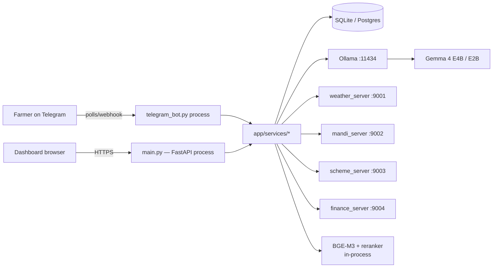
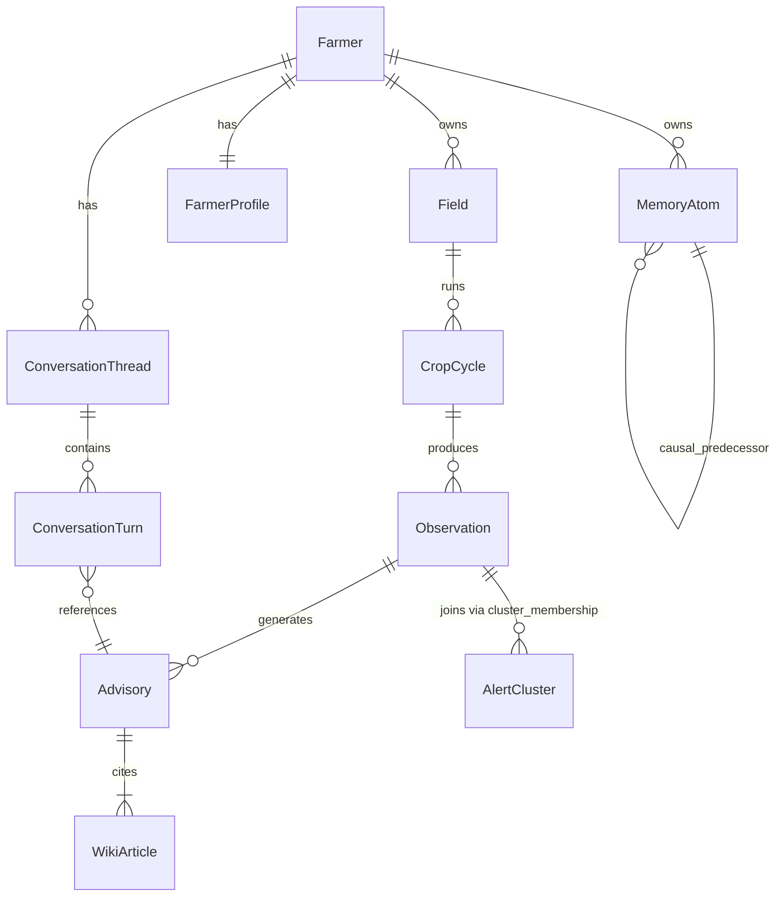
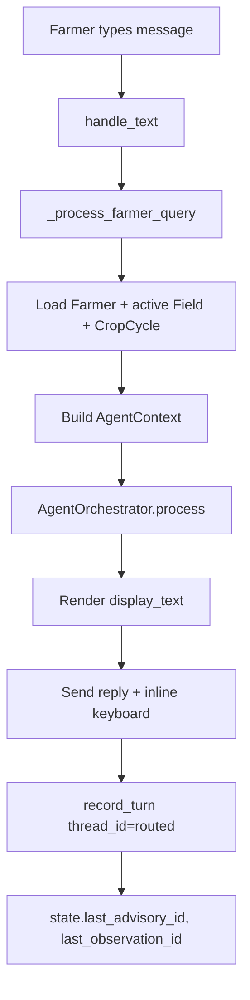
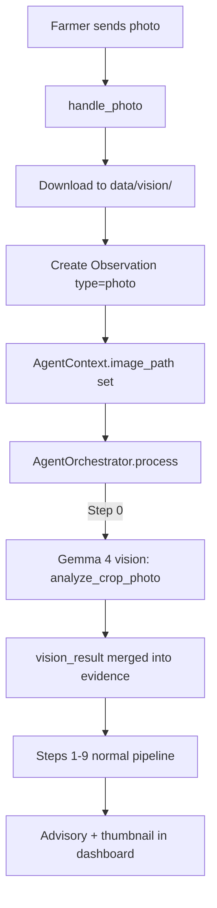
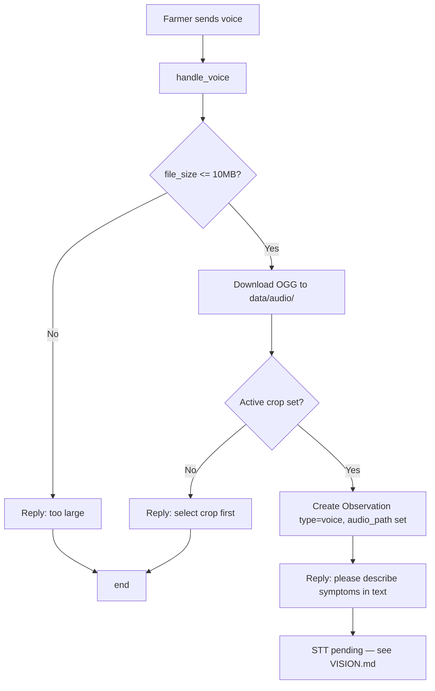
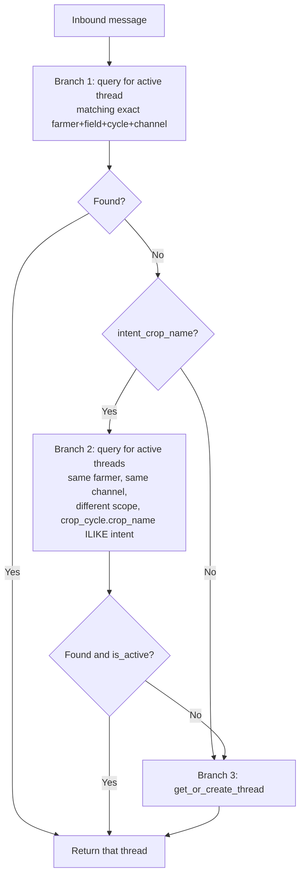
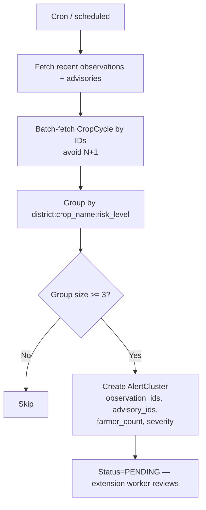

# AgentAgri — Architecture

> One source of truth for the **folder layout**, **what every module does**, and the **mermaid flow for every farmer action**.
> Pair this with [FEATURES.md](FEATURES.md) (what exists) and [WORKFLOW.md](WORKFLOW.md) (lifecycle of one query).

---

## 1. Top-Level Folder Map

```
AgentAgri/
├── app/                      ← all Python application code (importable)
│   ├── main.py               ← FastAPI app (PWA + eval dashboard + /api/v1)
│   ├── config.py             ← pydantic-settings, env-loaded, fail-fast in prod
│   ├── database.py           ← async SQLAlchemy engine + session factory
│   ├── models.py             ← core domain (Farmer, Field, CropCycle, …)
│   ├── models_memory.py      ← memory layer (MemoryAtom, ConversationThread, …)
│   ├── eval.py               ← live LLM smoke probes
│   ├── eval_synthetic.py     ← 200-case synthetic eval harness
│   │
│   ├── api/                  ← REST API layer
│   │   └── v1/auth.py        ← /api/v1/auth — login, demo sessions
│   │
│   ├── bot/                  ← Telegram bot (separate process)
│   │   └── telegram_bot.py   ← 2182 lines · 30 commands · all handlers
│   │
│   ├── services/             ← business logic (called by bot + API)
│   │   ├── agent.py          ← AgentOrchestrator — the 9-step pipeline
│   │   ├── conversation.py   ← threads, route_to_thread, record_turn
│   │   ├── memory.py         ← M1-M4 SOTA living memory
│   │   ├── retrieval.py      ← BGE-M3 dense + lexical + reranker
│   │   ├── verifier.py       ← 4-line truthfulness check
│   │   ├── pattern_discovery.py ← AlertCluster grouping
│   │   ├── farmer_dashboard.py  ← dashboard payload builder
│   │   ├── alerts.py         ← AlertCluster lifecycle
│   │   ├── cluster.py        ← cluster summarization
│   │   ├── degradation.py    ← graceful degradation on LLM/DB failure
│   │   ├── demo_seed.py      ← repeatable mock-farmer seeder
│   │   ├── evidence.py       ← EvidenceBundle assembly
│   │   ├── finance.py        ← farm P&L
│   │   ├── mandi.py          ← mandi price lookups
│   │   ├── market_intel.py   ← MSP context, price trend
│   │   ├── proactive.py      ← scheduled nudges
│   │   ├── scheme.py         ← govt scheme matching
│   │   └── weather.py        ← weather aggregation
│   │
│   ├── mcp_servers/          ← Model Context Protocol tool servers (separate procs)
│   │   ├── weather_server.py ← :9001  get_forecast, get_historical_weather
│   │   ├── mandi_server.py   ← :9002  get_mandi_prices
│   │   ├── scheme_server.py  ← :9003  match_schemes
│   │   └── finance_server.py ← :9004  compute_farm_finance
│   │
│   ├── schemas/              ← JSON grammars for LLM-constrained output
│   │   ├── cluster_summary.schema.json
│   │   ├── intent_classification.schema.json
│   │   ├── safety_check.schema.json
│   │   ├── template_selection.schema.json
│   │   └── tool_call.schema.json
│   │
│   └── utils/
│       ├── ollama_client.py  ← LLM client (intent, plan, select_template, vision)
│       ├── safety.py         ← SAFE_FALLBACK_HI + pesticide rules
│       ├── security.py       ← Argon2 hash, API limiter, demo-secret rotation
│       └── time.py           ← utc_now (single source for "now")
│
├── tests/                    ← 216 passing tests (pytest-asyncio auto-mode)
├── scripts/                  ← startup, seed, scorecard, demo-readiness
├── alembic/                  ← DB migrations (versions/)
├── data/                     ← runtime — SQLite DB, audio, vision crops
├── wiki/articles/            ← seed knowledge base (Markdown + frontmatter)
├── evals/                    ← golden_synthetic_v1 dataset + run outputs
├── pwa/                      ← Preact + Tailwind dashboard (built via npm)
├── docs/                     ← you are here
├── requirements.txt          ← pinned Python deps (see DEPENDENCIES.md)
├── docker-compose.yml        ← FastAPI + bot + 4 MCP servers + Ollama
├── Dockerfile                ← Python 3.11-slim base
├── Makefile                  ← `make dev`, `make test`, `make eval`
└── alembic.ini
```

---

## 2. Process Topology



The bot and the API are separate processes. Both import `app/services/*` and share the database — the bot writes during chat, the dashboard reads the same rows. There is no separate "bot DB" or "API DB".

---

## 3. Domain Model (Core Entities)



| Table | Lives in | Purpose |
|---|---|---|
| `Farmer`, `Field`, `CropCycle`, `Observation`, `Advisory`, `WikiArticle`, `AlertCluster`, `FarmerProfile`, `VerifierReport` | `app/models.py` | Core farming domain. |
| `MemoryAtom`, `ConversationThread`, `ConversationTurn` | `app/models_memory.py` | Memory + conversation layer. |

---

## 4. Function-Level Reference

The tables below cover **every public function and class** in `app/`. Internal helpers (`_foo`) are listed only when they're called from another module.

### 4.1 `app/services/agent.py` (`AgentOrchestrator`)

| Symbol | Role |
|---|---|
| `AgentContext` (dataclass) | Carries farmer + message + crop/stage/field/cycle + image_path + follow-up state through the pipeline. |
| `AgentResponse` (dataclass) | Output: advisory_id, display_text, risk_level, confidence, evidence_cards, verifier_report, latency_ms, model_used, retrieval_path, thinking_enabled. |
| `AgentOrchestrator.process(db, ctx)` | The 9-step pipeline (see [WORKFLOW.md](WORKFLOW.md)). |
| `_load_conversation_context(db, ctx)` | Pulls last N turns for follow-up resolution. |
| `_load_memory_context(db, ctx)` | M1 temporal-decay-weighted memory pull. |
| `_load_personal_profile_context(db, ctx)` | Profile facts (irrigation, soil, budget) for personalization. |
| `_load_ndvi_data(db, ctx)` | NDVI satellite slice for the active field. |
| `_execute_tool(name, params, ctx)` | Maps tool name → MCP HTTP call, signature-aware kwarg adaptation. |
| `_build_tool_only_response` | Synthesizes a response from tool output when no wiki articles match. |
| `_build_followup_response` | Deterministic monitor/continue path for follow-up turns with no fresh evidence. |
| `_no_evidence_response` | Conservative clarification fallback. |
| `_build_action_citation` (E1) | Inline `[📚 source • N cases • in district]` per action. |
| `_build_advisory_display` (E1/E2) | Confidence prefix + actions+citations + warnings + change summary. |
| `build_change_detection_summary` (E3) | Risk delta + new articles + days since last for follow-ups. |
| `_resolve_actions / _resolve_warnings` | Index → text lookup against the cited wiki articles. |
| `_tool_only_response` / `_no_evidence_response` | Persist Advisory + atoms + return safe display. |

### 4.2 `app/services/conversation.py`

| Symbol | Role |
|---|---|
| `route_to_thread(db, farmer_id, field_id, crop_cycle_id, intent_crop_name, channel='telegram')` | 3-branch routing: (1) exact-scope active thread, (2) cross-scope crop match, (3) fall through to `get_or_create_thread`. Case-insensitive crop match. Archived threads ignored. |
| `get_or_create_thread(...)` | Idempotent thread upsert for a (farmer, field, cycle, channel) scope. |
| `record_turn(db, ..., thread_id=None)` | Appends a `ConversationTurn`; honors explicit `thread_id`. |
| `previous_evidence_article_ids(...)` | Last advisory's article IDs (drives follow-up retrieval bias). |
| `_summarize_thread` | Rolling running-summary on every Nth turn. |
| `archive_thread(thread_id)` | Sets `is_active=False`. |

### 4.3 `app/services/memory.py`

| Symbol | Role |
|---|---|
| `extract_from_observation(db, obs, advisory)` | Mints atoms: `observation_recorded`, `vision_analysis`, indicator atoms, `advisory_given`. Links causal chain. |
| `extract_from_outcome(db, observation_id, result, comment, rating)` | M2: mints `outcome_reported` atom + boosts confidence of atoms in the causal chain (improved+rating≥4 → +0.10; worsened → -0.08). |
| `retrieve_memory_context(db, farmer_id, field_id, crop_name, risk_type, top_k=8)` | M1: fetches atoms, applies temporal decay, returns top-k by `confidence × temporal_weight`. |
| `retrieve_similar_farm_context(db, farmer_id, crop_name, stage, district, top_k=5, min_farmers_for_privacy=3)` | M4: k-anonymous cross-farm pulls (same district, same crop, last 60d). |
| `get_causal_chain(db, atom_id, max_hops=6)` | M3: traverses `causal_predecessor_atom_id`; cycle-detection bounded by max_hops + visited set. |
| `_temporal_weight(event_at, atom_type)` | `exp(-0.693 × days / half_life)`; half-lives per atom_type (disease 30d, pest 45d, market 7d, weather 3d, outcome 90d). |
| `_confidence_from_richness(atoms, farmer_count)` | LOW/MEDIUM/HIGH gate with 14-day recency bias. |

### 4.4 `app/services/retrieval.py`

| Symbol | Role |
|---|---|
| `speculative_retrieve(db, query, crop_name, stage, topic_tags, is_followup, previous_article_ids)` | Top-level retrieval entrypoint. Dense + sparse → rerank → top-3. |
| `embedder` | Lazily loaded BGE-M3 (global, single load). |
| `reranker` | Lazily loaded BGE-reranker-v2-m3. |
| `_lexical_boost` | Title + tag overlap with topic_tags. |
| `_rerank(query, candidates)` | Cross-encoder rerank with title+tag co-mention boost. |

### 4.5 `app/services/verifier.py`

| Symbol | Role |
|---|---|
| `VerifierService.verify(rec, ev)` | Runs the 4 lines below; returns `(VerifierReport, safe_fallback_or_None)`. |
| `_check_structural` | Action/warning indices resolve to real articles. |
| `_check_memory_contradiction` | BGE-M3 cosine ≥ 0.80 + bilingual completion marker → contradiction. |
| `_check_calibration` | HIGH requires ≥3 articles AND (≥5 atoms OR 14d-recent evidence). |
| `_check_safety` | Pesticide dosage, re-entry interval, banned chemicals; bypasses calibration/structural. |
| `EvidenceBundle`, `Recommendation`, `VerifierReport` (dataclasses) | DTOs across the pipeline. |

### 4.6 `app/services/pattern_discovery.py`

| Symbol | Role |
|---|---|
| `discover_patterns(observations, advisories)` | Groups by `(district, crop_name, risk_level)` (NOT crop_cycle_id). Batch-fetches cycles. ≥3 obs → AlertCluster. |
| `_compute_severity` | Severity score from observation density + risk levels. |

### 4.7 `app/services/farmer_dashboard.py`

| Symbol | Role |
|---|---|
| `get_dashboard_payload(db, farmer_id)` | Full PWA payload: farmer header, active cycle, fields, threads, advisories, NDVI, weather, market. |
| `_field_cards(db, farmer)` | Per-field cards with active cycle + threads strip (phase 6). |
| `_threads_for_field(db, farmer_id, field_id)` | `{"active": [...], "archived": [...]}` with last-3-turns + truncated running_summary. |
| `_tasks_for_cycle` | Stage-aware task list (sowing → harvest). |

### 4.8 `app/utils/ollama_client.py`

| Symbol | Role |
|---|---|
| `OllamaClient.classify_intent(message, language, conversation_context)` | LLM-extracted intent + crop + stage + region + topic_tags + follow-up + referenced_action/problem. |
| `OllamaClient.plan_tools(message, context)` | ReAct planning, thinking ON, grammar-constrained JSON. |
| `OllamaClient.select_template(message, articles, memory_context)` | Grammar-constrained final template selection. |
| `OllamaClient.analyze_crop_photo(image_path, prompt)` | Vision call on Gemma 4 (multimodal); returns disease/pest hypothesis + confidence. |
| `OllamaClient._call_with_retry` | Retry + graceful degrade on empty grammar output. |
| `get_ollama()` | Module-level singleton. |

### 4.9 `app/bot/telegram_bot.py`

**Commands** (30 total) — see [FEATURES.md §1](FEATURES.md) for the table.

**Internal helpers:**

| Symbol | Role |
|---|---|
| `_process_farmer_query` | Dispatches text/photo/voice to `AgentOrchestrator.process`. Renders advisory + keyboard row (Threads / New thread). |
| `_resolve_farmer_id(state, user_id)` | Maps Telegram user_id → Farmer.id. |
| `_current_active_thread(db, farmer_id)` | Most recent active ConversationThread. |
| `_archive_active_thread(user_id, state)` | Called by `newthread_confirm` and `/endthread`. |
| `_show_threads(update, user_id, show_archived)` | Renders `/threads` list with switch buttons. |
| `_handle_*_registration` | Multi-step registration state machine. |
| `_handle_crop_sowing_date` | DD/MM/YYYY parsing + "आज/today" + future/before-registration validation. |
| `handle_callback` | Single dispatcher for all inline button callbacks. |
| `handle_voice` | Saves OGG ≤10MB to `data/audio/`, mints `Observation`. |
| `handle_photo` | Downloads photo, passes path through `AgentContext.image_path`. |

### 4.10 Other utilities

| File | Symbol | Role |
|---|---|---|
| `app/utils/safety.py` | `SAFE_FALLBACK_HI`, `is_safe_pesticide_advice` | Hindi fallback string; safety predicates. |
| `app/utils/security.py` | `hash_password`, `verify_password`, `get_api_limiter`, `rotate_demo_secret` | Argon2 + rate limit + demo auth. |
| `app/utils/time.py` | `utc_now()` | Single timezone-aware "now" source. |

---

## 5. Action-Level Flows (Mermaid)

The lifecycle of a generic message is in [WORKFLOW.md](WORKFLOW.md). Below are flows for individual user actions.

### 5.1 `/register` — multi-step onboarding

```mermaid
flowchart TD
    A[/register] --> B[Ask name]
    B --> C[Ask phone]
    C --> D[Ask district]
    D --> E[Ask tehsil]
    E --> F[Ask village]
    F --> G[Inline buttons: farm size]
    G --> H[Persist Farmer + FarmerProfile]
    H --> I[state=ready · welcome message]
```

### 5.2 `/newcycle` — start a crop cycle

```mermaid
flowchart TD
    A[/newcycle] --> B[Ask crop]
    B --> C[Ask stage]
    C --> D[Ask variety - optional, skip = NULL]
    D --> E[Ask sowing date]
    E --> F{Parse date}
    F -->|आज/today| G[Use utc_now]
    F -->|DD/MM/YYYY| H{Future?}
    F -->|invalid| E
    H -->|Yes| I[Reject: cannot be future] --> E
    H -->|No| J{Before registration?}
    J -->|Yes| K[Reject] --> E
    J -->|No| L[Persist CropCycle]
    G --> L
    L --> M[state=ready · set active cycle]
```

### 5.3 Free-text query → advisory



### 5.4 Photo upload → vision + advisory



### 5.5 Voice / audio upload



### 5.6 `/feedback rating comment`

```mermaid
flowchart TD
    A[/feedback 5 working great] --> B[Parse rating + comment]
    B --> C{state.last_advisory_id?}
    C -->|No| D[Reply: no recent advisory] --> X[end]
    C -->|Yes| E[Update Advisory.farmer_feedback + feedback_text]
    E --> F[Commit] --> G[Ack to farmer]
```

### 5.7 `/outcome improved|no_change|worsened comment`

```mermaid
flowchart TD
    A[/outcome improved much better] --> B[Parse result + comment]
    B --> C{state.last_observation_id?}
    C -->|No| D[Reply: no recent observation] --> X[end]
    C -->|Yes| E{Within 30 days?}
    E -->|No| F[Reply: window closed] --> X
    E -->|Yes| G[Update Observation.outcome_*]
    G --> H[extract_from_outcome → mint outcome atom]
    H --> I[Boost atoms in causal chain<br/>improved+r>=4: +0.10, worsened: -0.08]
    I --> J[Commit] --> K[Ack to farmer]
```

### 5.8 `/threads`, `/newthread`, `/endthread`

```mermaid
flowchart TD
    subgraph threads[/threads]
        T1[/threads] --> T2[_show_threads show_archived=False]
        T2 --> T3[Render active list + 'Show archived' button]
        T3 --> T4{User clicks}
        T4 -->|thread_switch:id| T5[Load thread → set field+cycle in state]
        T4 -->|threads_show_archived| T6[_show_threads show_archived=True]
    end
    subgraph new[/newthread]
        N1[/newthread] --> N2[Confirm/Cancel buttons]
        N2 -->|newthread_confirm| N3[_archive_active_thread]
        N3 --> N4[Next query creates new thread]
        N2 -->|newthread_cancel| N5[No-op]
    end
    subgraph endgraph[/endthread]
        E1[/endthread] --> E2[_archive_active_thread]
    end
```

### 5.9 Conversation routing (`route_to_thread`)



### 5.10 Pattern discovery → AlertCluster



---

## 6. Configuration Surface

All env vars live in `app/config.py`. Defaults are dev-safe; `app_env=production` triggers a strict validator that rejects placeholders, SQLite, demo mode, and `*` CORS.

| Variable | Default | Purpose |
|---|---|---|
| `APP_ENV` | `development` | dev / test / demo / production |
| `OLLAMA_HOST` | `http://localhost:11434` | Ollama endpoint |
| `OLLAMA_MODEL` / `OLLAMA_FALLBACK_MODEL` | `gemma4:e4b` / `gemma4:e2b` | Primary + fallback model |
| `DATABASE_URL` | sqlite | Async SQLAlchemy URL |
| `TELEGRAM_BOT_TOKEN` | "" | Bot token (see [SETUP.md](SETUP.md)) |
| `MCP_*_PORT` | 9001-9004 | Each MCP server's port |
| `AGRIMESH_API_KEY` | "" | Required ≥32 chars in production |
| `BOT_DEMO_SECRET_CURRENT` | "" | Rotating demo auth secret |
| `USE_GEMMA_AUDIO` / `ENABLE_VOICE_STT` / `ENABLE_BHOJPURI` | false | Feature flags |

Full list → `app/config.py:Settings`.

---

## 7. JSON Grammars

Grammar-constrained decoding (`USE_GRAMMAR_DECODING=true`) forces the LLM to emit valid JSON for every reasoning step. Each step has its own schema in `app/schemas/`:

| Step | Schema |
|---|---|
| Intent classification | `intent_classification.schema.json` |
| ReAct tool planning | `tool_call.schema.json` |
| Template selection (final advisory) | `template_selection.schema.json` |
| Safety check | `safety_check.schema.json` |
| Cluster summary | `cluster_summary.schema.json` |

This eliminates JSON-parse errors and is the reason the verifier can mechanically index actions by integer position.

---

## 8. Where to Look First (Debugging Map)

| Symptom | Look in |
|---|---|
| Bot doesn't reply | `telegram_bot.py::handle_text`, `_process_farmer_query` |
| Advisory missing citations | `agent.py::_build_action_citation`, `verifier.py::_check_structural` |
| Wrong thread | `conversation.py::route_to_thread`, `tests/test_conversation_routing.py` |
| Memory not boosting after outcome | `memory.py::extract_from_outcome`, `telegram_bot.py::outcome_command` |
| HIGH confidence too easy | `verifier.py::_check_calibration` |
| Tool not firing | `agent.py::_execute_tool`, the relevant MCP server |
| Retrieval irrelevant | `retrieval.py::speculative_retrieve` + `_rerank` |
| Vision returning generic | `ollama_client.py::analyze_crop_photo` |
