# AgentAgri — Workflows for Every Action

Every farmer-facing action mapped to code, with a mermaid diagram per flow. Companion to [ARCHITECTURE.md](ARCHITECTURE.md) (function map) and [FEATURES.md](FEATURES.md) (capability list).

---

## 0. Top-level request lifecycle

The shape every Telegram message follows once it reaches `AgentOrchestrator.process()` in `app/services/agent.py`.

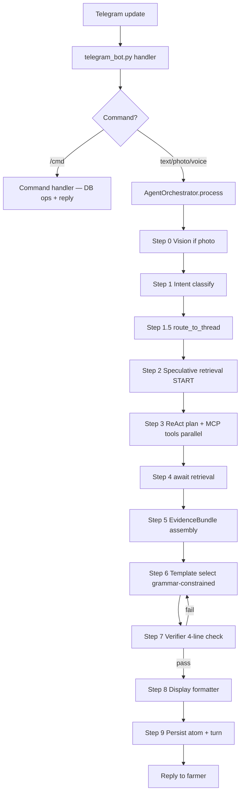

---

## 1. `/register` — onboarding a new farmer

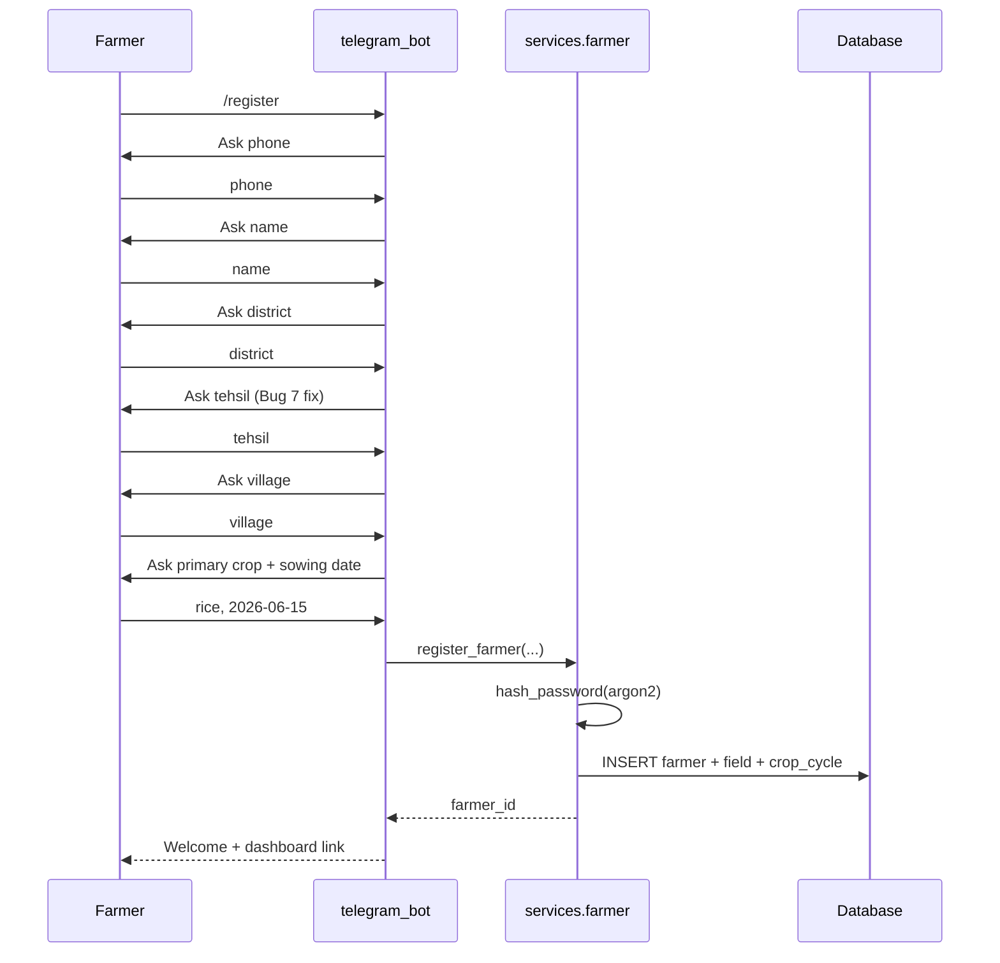

Files: `app/bot/telegram_bot.py::register_*`, `app/services/farmer.py::register_farmer`.

---

## 2. `/newcycle` — start a new crop cycle on an existing field

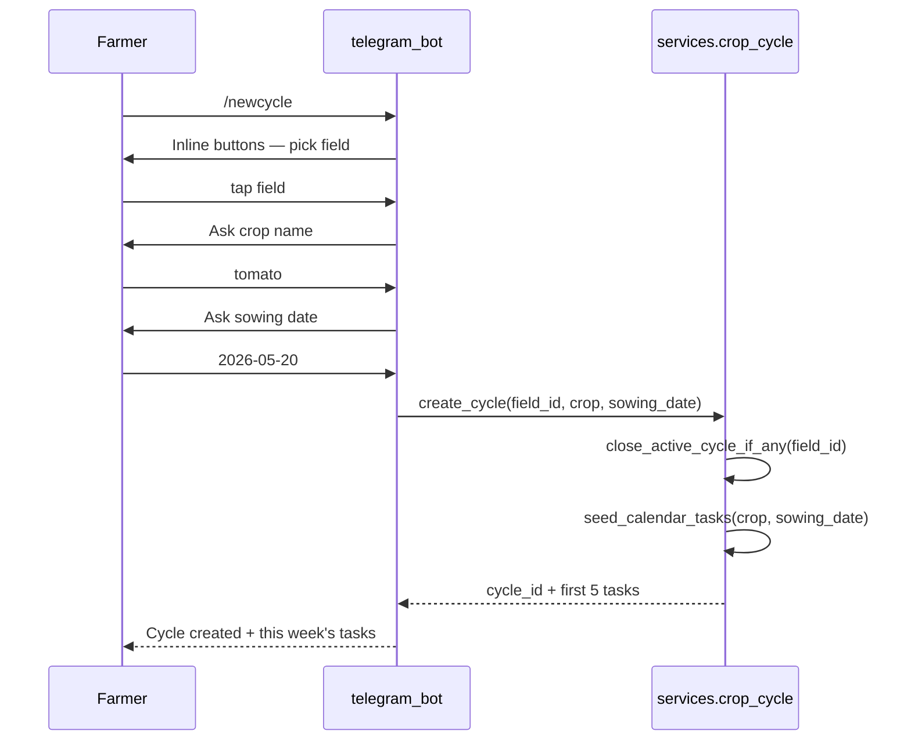

Files: `app/services/crop_cycle.py`, `app/services/calendar.py`.

---

## 3. Free-text question — the main agent loop

The path 90% of farmer messages take. Photo and voice converge here after their preprocessing.

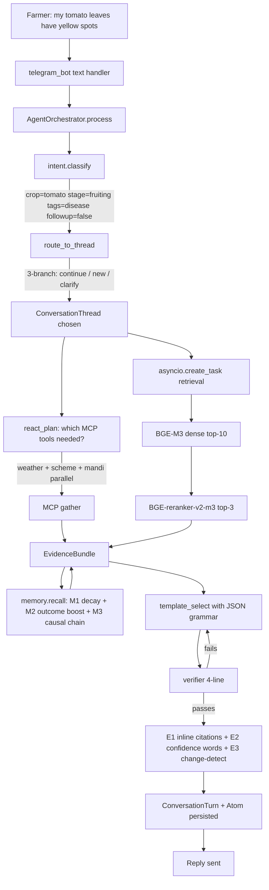

---

## 4. Photo upload — Gemma vision + disease ID

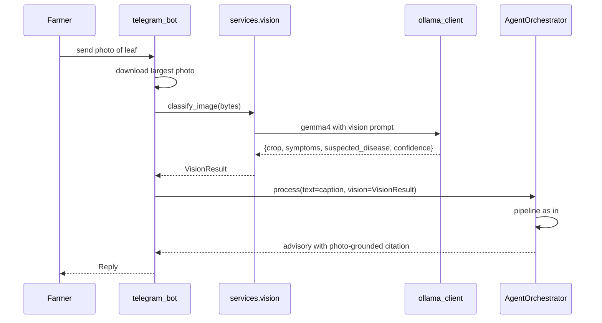

Files: `app/services/vision.py`, `app/services/agent.py` Step 0.

---

## 5. Voice note — STT then agent

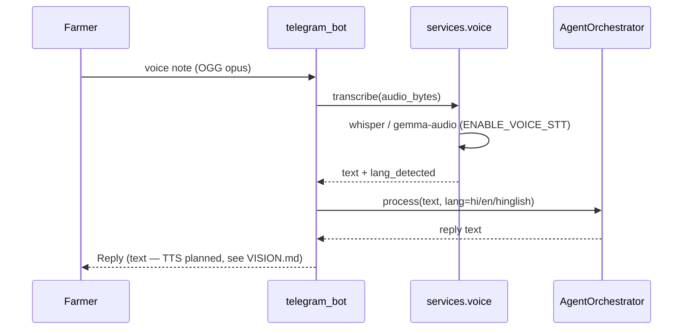

Files: `app/services/voice.py`, `app/bot/telegram_bot.py::voice_handler`.

---

## 6. `/feedback` — farmer rates an advisory

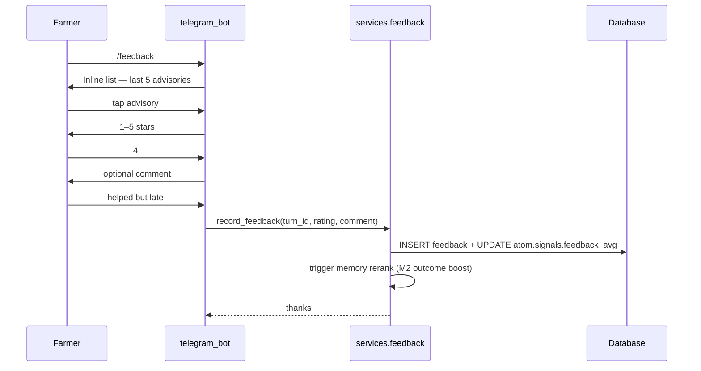

Files: `app/services/feedback.py`. Feeds the M2 outcome-boost signal in `app/services/memory.py`.

---

## 7. `/outcome` — farmer reports what happened

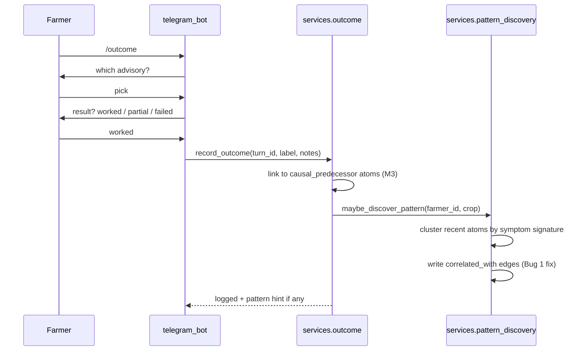

Files: `app/services/outcome.py`, `app/services/pattern_discovery.py`.

---

## 8. `/threads`, `/newthread`, `/endthread` — conversation routing

```mermaid
flowchart LR
    subgraph threads[/threads]
        A1[List active ConversationThreads] --> A2[Show last turn per thread]
    end
    subgraph newthread[/newthread]
        B1[End current active thread] --> B2[Create new thread] --> B3[Next msg seeds it]
    end
    subgraph endgraph[/endthread]
        C1[Mark active=false] --> C2[Next msg starts fresh]
    end
```

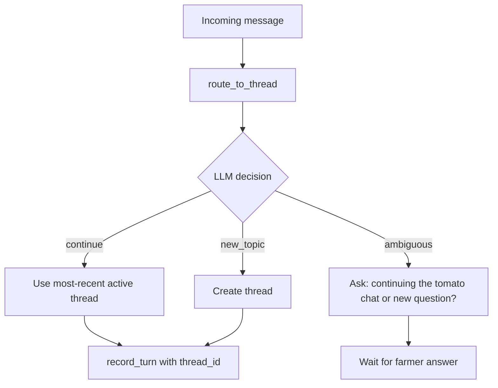

Files: `app/services/conversation.py::route_to_thread`, `record_turn`. Wiring tested in `tests/test_conversation_wiring.py`.

---

## 9. `/dashboard` — web infographic view

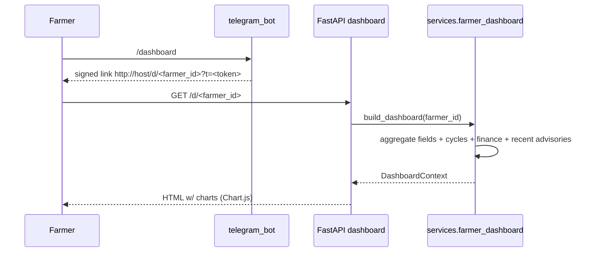

Files: `app/api/dashboard.py`, `app/services/farmer_dashboard.py`, `app/templates/dashboard.html`.

---

## 10. MCP tool call — weather example

Same shape for mandi, scheme, finance — each is a standalone process.

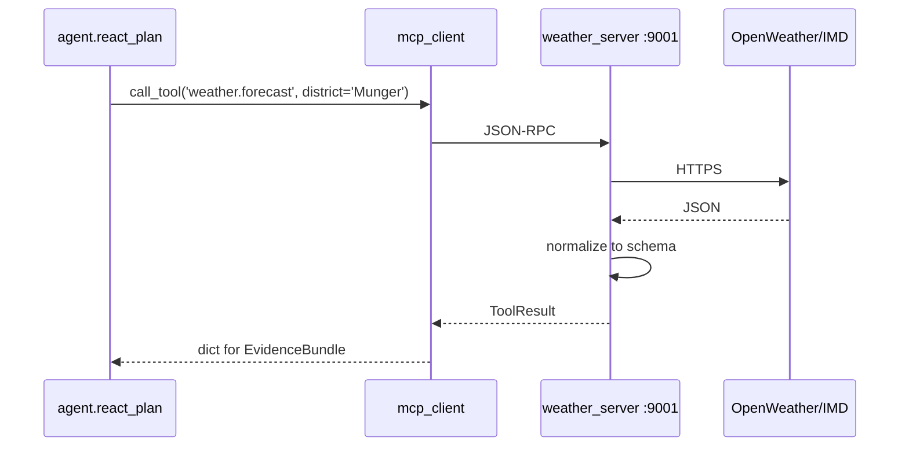

Files: `app/mcp/client.py`, `app/mcp/weather_server.py` (and `mandi_server.py`, `scheme_server.py`, `finance_server.py`).

---

## 11. Memory recall — M1 decay + M2 boost + M3 causal chain

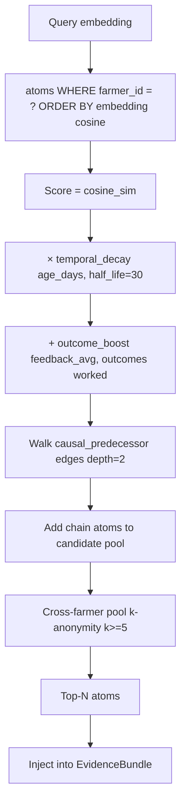

Files: `app/services/memory.py` — functions `recall_with_decay`, `apply_outcome_boost`, `walk_causal_chain`, `cross_farmer_pool`.

---

## 12. Pattern discovery — background loop

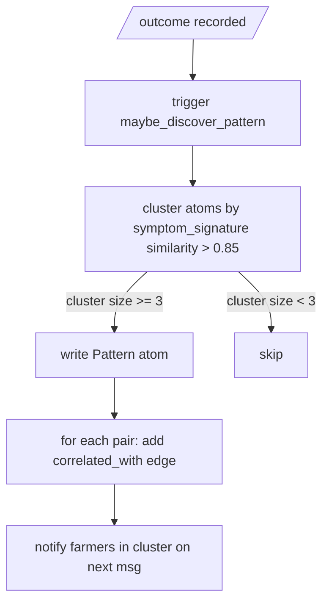

Files: `app/services/pattern_discovery.py`. Bug 1 ensured the edge label is `correlated_with`, not `causes_of`.

---

## 13. Verifier — the 4-line check before reply

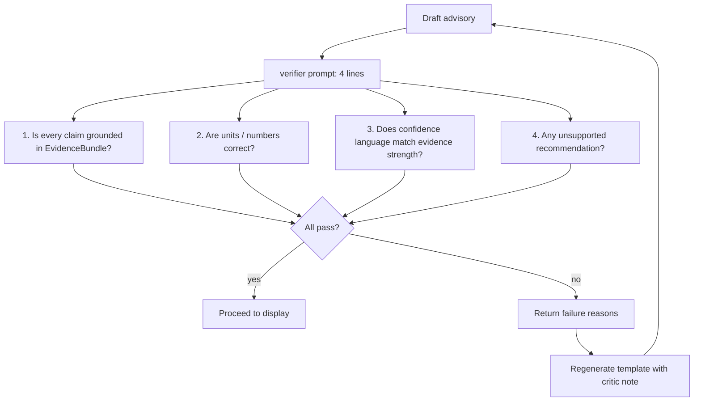

Bounded to 2 retries; on third failure the agent ships a hedged "I'm not sure — please call the local KVK" reply. Files: `app/services/verifier.py`.

---

## 14. Evidence assembly — what goes into a reply

```mermaid
flowchart LR
    W[Wiki passages top-3 reranked] --> EB[EvidenceBundle]
    WX[Weather forecast] --> EB
    M[Mandi prices] --> EB
    SC[Scheme matches] --> EB
    FI[Finance snapshot] --> EB
    ME[Memory atoms M1+M2+M3] --> EB
    NDVI[NDVI tile if available] --> EB
    EB --> CIT[E1 inline citations [W1] [Wx]]
    EB --> CONF[E2 confidence language by source strength]
    EB --> CHG[E3 change detection vs last reply]
```

Files: `app/services/agent.py::_build_evidence_bundle`, `app/services/evidence.py`.

---

## 15. Test & eval loop

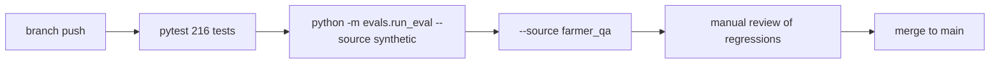

Files: `tests/`, `evals/run_eval.py`, `evals/cases/`.
